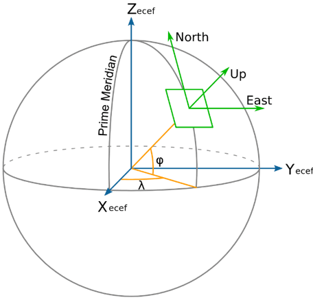
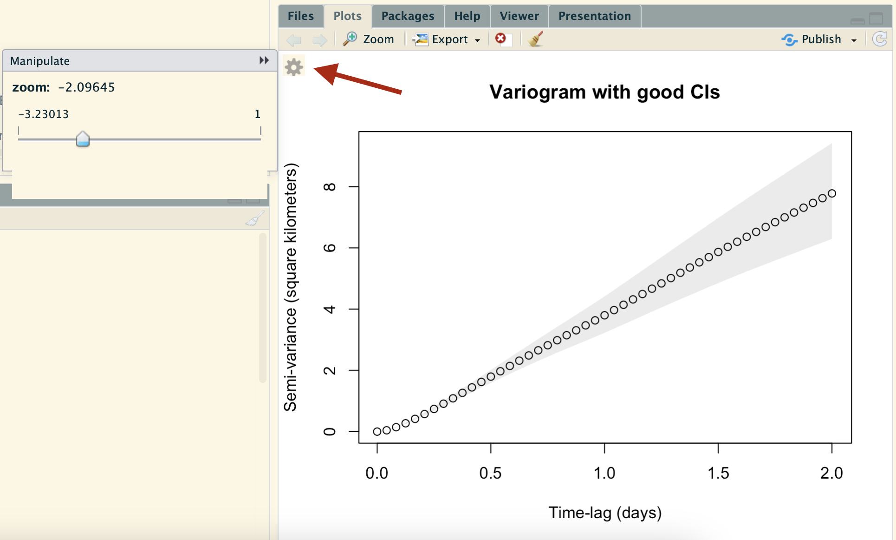
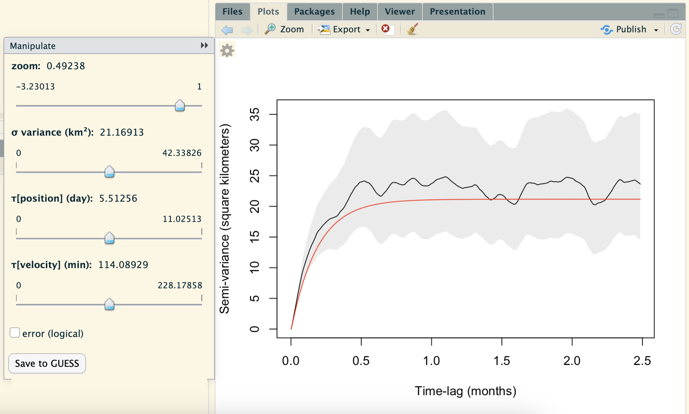
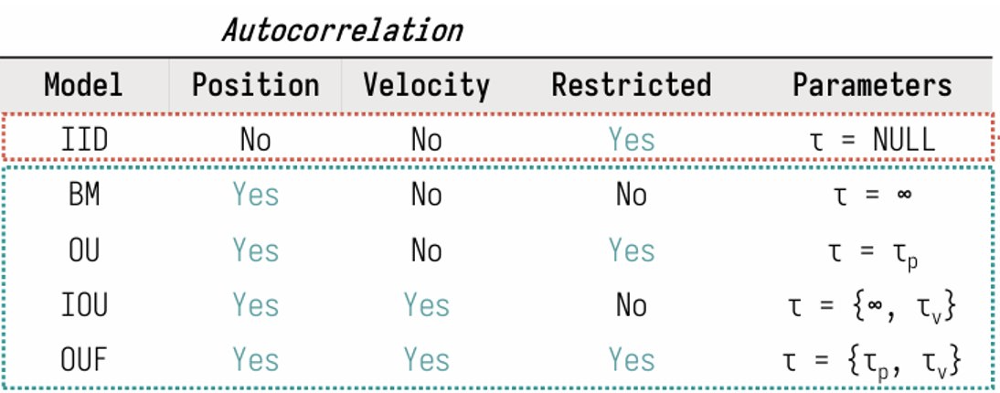
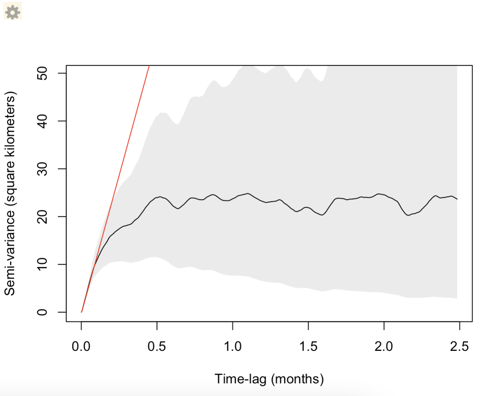

```{r setup, include=FALSE}
knitr::opts_chunk$set(echo = TRUE)
```

*Created: 2026-06-25* | *Last updated: `r Sys.Date()`*

<a href="https://github.com/ctmm-initiative/ctmmlearn.git" class="github-corner" aria-label="View source on GitHub"><svg width="80" height="80" viewBox="0 0 250 250" style="fill:#151513; color:#fff; position: absolute; top: 0; border: 0; right: 0;" aria-hidden="true"><path d="M0,0 L115,115 L130,115 L142,142 L250,250 L250,0 Z"></path><path d="M128.3,109.0 C113.8,99.7 119.0,89.6 119.0,89.6 C122.0,82.7 120.5,78.6 120.5,78.6 C119.2,72.0 123.4,76.3 123.4,76.3 C127.3,80.9 125.5,87.3 125.5,87.3 C122.9,97.6 130.6,101.9 134.4,103.2" fill="currentColor" style="transform-origin: 130px 106px;" class="octo-arm"></path><path d="M115.0,115.0 C114.9,115.1 118.7,116.5 119.8,115.4 L133.7,101.6 C136.9,99.2 139.9,98.4 142.2,98.6 C133.8,88.0 127.5,74.4 143.8,58.0 C148.5,53.4 154.0,51.2 159.7,51.0 C160.3,49.4 163.2,43.6 171.4,40.1 C171.4,40.1 176.1,42.5 178.8,56.2 C183.1,58.6 187.2,61.8 190.9,65.4 C194.5,69.0 197.7,73.2 200.1,77.6 C213.8,80.2 216.3,84.9 216.3,84.9 C212.7,93.1 206.9,96.0 205.4,96.6 C205.1,102.4 203.0,107.8 198.3,112.5 C181.9,128.9 168.3,122.5 157.7,114.1 C157.9,116.9 156.7,120.9 152.7,124.9 L141.0,136.5 C139.8,137.7 141.6,141.9 141.8,141.8 Z" fill="currentColor" class="octo-body"></path></svg></a><style>.github-corner:hover .octo-arm{animation:octocat-wave 560ms ease-in-out}@keyframes octocat-wave{0%,100%{transform:rotate(0)}20%,60%{transform:rotate(-25deg)}40%,80%{transform:rotate(10deg)}}@media (max-width:500px){.github-corner:hover .octo-arm{animation:none}.github-corner .octo-arm{animation:octocat-wave 560ms ease-in-out}}</style>

---

## Learning Objectives

By the end of this module you will be able to:

1. Understand the conceptualization and importance of the continuous-time movement modeling framework.
2. Find resources available for working with `ctmm`.
3. Import animal tracking data from Movebank into R using `ctmm` and converting to `telemetry` objects.
4. Visualize tracking data and change their projection.
5. Visualize autocorrelation in tracking data with variograms and model this autocorrelation.
6. Perform model selection on range resident and non-resident models to identify which best fits your data.

**Packages used:** `ctmm`

---

## Continuous-Time Movement Modeling

The [Continuous-Time Movement Modeling (CTMM) Initiative](https://github.com/ctmm-initiative) seeks to address many of the statistical and logistical challenges we face when working with animal tracking data. As technology for animal tracking improves, we need to build tools to be able to handle the increased resolutions and amounts of data we collect. Autocorrelation in our tracking data is a major issue that must be accounted for accordingly in our analyses to reduce bias and avoid being overly confident in our results. Additionally, sampling schedules may be irregular or differ across individuals, meaning that data must be thinned to satisfy the assumptions of discrete-time methods. Continuous-time methods can address these issues, offering a more realistic approach to animal movement modeling with a wider scope of inference. The `ctmm` R package is a growing set of tools that have been developed for continuous-time movement modeling, and it continues to be updated with new functions and resources. 

### Helpful Resources

```{r help, eval = FALSE}

# Help files (documentation)
help(package = "ctmm")

# Vignettes (walkthrough tutorials)
browseVignettes(package = "ctmm")

# Frequently asked questions (FAQ)
help("ctmm-FAQ", package = "ctmm")

# ctmm user group for any questions or help
browseURL("https://groups.google.com/g/ctmm-user")

# Issue reporting
browseURL("https://github.com/ctmm-initiative/ctmm/issues")

# ctmm learning material - where the code script from this document can be found
browseURL("https://github.com/ctmm-initiative/ctmmlearn")

# ctmm manuscripts
browseURL("https://www.dropbox.com/sh/55ylq4rbm9pl4d9/AAC2WlRCfgQDYrVRpu5pgrfFa?dl=0")

# Development branch of ctmm (more recent than the CRAN version)
remotes::install_github("ctmm-initiative/ctmm")

# What's new in ctmm
news(package = "ctmm")

# ctmmweb: point-and-click app - if you know anyone that doesn't use R
remotes::install_github("ctmm-initiative/ctmmweb")
ctmmweb::app()

# ctmm MoveApps
browseURL("https://www.moveapps.org/apps/browser?q=ctmm")

```

## Data Preparation

```{r load_packages, eval = FALSE}

# Install the latest version of ctmm from GitHub
remotes::install_github("ctmm-initiative/ctmm")

```

```{r load_packages2}

# Load the ctmm package
library(ctmm)

```

This package works primarily (and best) with data available on [MoveBank](https://www.movebank.org/). You can upload your data to MoveBank, ensuring that your telemetry data follows standard formatting, which would make it compatible with a wide variety of tools associated with MoveBank (e.g., MoveApps, `ctmm`, etc.). This will help ensure that your data are of the correct format for `ctmm`, help you identify outliers, and you can keep your data completely private if you wish. `ctmm` requires that your dataframe conforms to Movebank naming conventions (see `help(as.telemetry)`).The `as.telemetry` function works with most tabulated tracking data formats and is periodically updated to include new column names to accommodate how GPS location data is collected for different studies. Some manual column renaming may be needed if you are unable to upload your data to MoveBank.

For example, you can choose to import your data directly with `as.telemetry` as a comma-delimited files (comma separated values, CSV or ".csv")

```{r as.telemetry, eval = FALSE}

yourAnimals <- as.telemetry("yourAnimalsMoveBank.csv")

```

Alternatively, if you want to clean your CSV file first, you can import it as a data frame, and then edit the data frame before converting it into a telemetry object for `ctmm`:

```{r as.telemetry2, eval = FALSE}

yourAnimalsDF <- read.csv("yourAnimalsMoveBank.csv")  # import dataframe from CSV
yourAnimals <- as.telemetry(yourAnimalsDF)  # convert dataframe to telemetry object

```

`as.telemetry` also works on `Move` objects, which can be useful as the `move` package interfaces directly with MoveBank through R (see `help(move::getMovebankData)`).

The output of `as.telemetry` will be either an individual `telemetry` object, if you only have one individual in your CSV file, or list of `telemetry` objects, if you have more than one individual animals are in your CSV file. The basic structure of a `telemetry` object is a data frame with the following columns:

| Column | Description | Notes |
|:---|:---|:---|
| `timestamp` | Date and time at which the location was recorded | "Year-Month-Day Hour:Minute:Second". Messages generated by `as.telemetry` may warn users about improper time formatting or spurious relocations. Possible outliers can be examined with the help of the `outlie` function. |
| `longitude` | Longitudinal coordinate position | Only if the geographic location is available for your data |
| `latitude` | Latitudinal coordinate position | Only if the geographic location is available for your data |
| `t` | Time in seconds |  |
| `x` | x for the projected locations in meters | |
| `y` | y for the projected locations in meters | |

Additional arguments within `as.telemetry` may be used to specify whether you would like to keep (`keep = ...`) other metadata columns (e.g., sex, age, site, etc.), or choose a specific projection (`projection`) or timezone (`timezone`) for the data. By default `timezone = "UTC"`.

### Import Buffalo Data 

Here, we will demonstrate the first step of importing data with `ctmm` using data on 6 GPS-collared African buffalo (*Syncerus caffer*) in Kruger National Park, South Africa.

```{r import_data, eval = FALSE}

# STEP 1: Get data through MoveBank
# STEP 2: Import data with as.telemetry()
help("as.telemetry")

```

```{r import_data2}

# Load data from Movebank CSV (which can be compressed)
Buffalo <- as.telemetry("data/Kruger African Buffalo, GPS tracking, South Africa.zip")
## You can also import from a move object, data.frame, etc.
## GPS location error can be an issue if greater than the sampling timesteps

# Load buffalo dataset from ctmm
data(buffalo)  # this data is available within the package
# help("buffalo")  # information on this data can be found at its help page

# This is a list of buffalo telemetry objects 
class(buffalo)  # all listed objects are telemetry objects

# Number of buffalo datasets
length(buffalo)  # There are 6 individuals

class(buffalo[[1]])  # ctmm telemetry object
head(buffalo[[1]])

# Names of buffalo
names(buffalo) 

# Summary of buffalo data
summary(buffalo)
## Note: 1 hour sampling for all individuals except Pepper's collar malfunctioned (2 hours)

```

### Visualizing Telemetry Data

We can visualize this the location points using the `plot.telemetry` function, which works automatically when running `plot()` on a `telemetry` object. We can also use the `zoom` function to zoom into (enlarge) and inspect specific parts of the plot, using a gear icon that appears in the top left corner of the "Plots" panel in RStudio. Note: Sometimes RStudio can be buggy, so the function may need to be rerun more than once for the gear icon to appear.

Here are the arguments that can be adjusted for the plotting functions. Additional plotting parameters are passed on to Base R `plot`.

```{r plot_help, eval = FALSE}

## S3 method for class 'telemetry'
plot(x, CTMM=NULL, UD=NULL, col.bg="white", cex=NULL, col="red", lwd=1, pch=1, type='p',
     error=TRUE, transparency.error=0.25, velocity=FALSE, DF="CDF", col.UD="blue",
     col.grid="white", labels=NULL, level=0.95, level.UD=0.95, convex=FALSE, 
     col.level="black", lwd.level=1, SP=NULL, border.SP=TRUE, col.SP=NA, R=NULL, 
     col.R="green", legend=FALSE, fraction=1, xlim=NULL, ylim=NULL, ext=NULL, 
     units=TRUE, add=FALSE, ...)

## S4 method for signature 'telemetry'
zoom(x, fraction=1, ...)

```

For example: 

```{r plot.telemetry}

# Plot all buffalo
plot(buffalo, main = "6 African buffalo")  # telemetry tracking data for all 6 indivs

```

But they are all the same color, so it is difficult to tell apart the individuals.

```{r plot.telemetry2}

# Plot buffalo with list-sorted rainbow of colors
COL <- rainbow(length(buffalo))
plot(buffalo, col = COL, main = "Rainbow colors")  # rainbow by default

```

In the image above, can you tell that there are 3 individuals in the right cluster?

`ctmm` includes a `color` function, which can color by individuals, such that individuals closer together in space are more distinct in color. There are different built-in coloring options for telemetry objects (see `help("color")`). You can color by sunlight, moonlight, season, time, etc. Let's give separate, high-contrast colors to each individual buffalo:

```{r color}

# Plot buffalo with spatially-separated rainbow of colors
COL <- color(buffalo, by = 'individual')
plot(buffalo, col = COL, main = "Spatial color separation")

```

### Projections

To work with spatial data accurately, we need Coordinate Reference Systems (CRS), and in the case of tracking data, we are working with a planimetric CRS: Earth’s coordinates are projected onto a two-dimensional planar surface. Ideally, we want a projection without distortion, so that it is tangent to where the map is on the globe. Using a projection that is locally flat over your data will minimize distortion; the further out in projection, the more distorted. Generally, it is good to use local projections, unless we want to work with remote sensing data, in which case, we may want to reproject our data to match the remote sensing product.

<center>

{width=250px height=250px}

<span style="color: gray;"> 2-dimensional projection plane with reference to 3-dimensional geography. Image from [Janssen (2011).](https://www.researchgate.net/figure/Ellipsoidal-coordinate-reference-systems-Cartesian-geographic-and-local-topocentric_fig1_260210654) </span>

</center>

A flat projection is necessary, and for most species the default two-point equidistant projection will be fine. However, you can provide any PROJ.4 formatted projection with the projection argument (`see help(as.telemetry)`). A single fixed projection should be used if you are going to plot groups of individuals that span multiple MoveBank files. This is done by default if multiple individuals are included in a single data frame, like with our buffalo data. By default, as.telemetry() will choose a two-point equidistant projection, which is safer for migratory species, but does not preserve North = up.

```{r projection}

# What projection are the buffalo in?
projection(buffalo)
# 2 point as equidistant object is the safest

# The algorithm can be found in:
# ctmm:::median_longlat
## and automates the estimation of k=2 geometric median (robust) clusters

median(buffalo)

# Show north on plot (puts North facing to the side due to foci on horizontal)
# compass()

# Center the projection on the geometric median of the data
projection(buffalo) <- median(buffalo)

projection(buffalo)  # new projection centered on geometric median of telemetry data

# Changes the method so that North is now up
plot(buffalo, col = COL, main = "Azimuthal-equidistant projection") + 
  compass()

```

## The Standard CTMM Workflow

> 1. <span style="color: gray;"> Import and inspect data
>     * Summarize key information on sampling (interval, duration, number of individuals tracked, etc.).
>     * Visualize the tracking data and check the projection. </span>
> 2. Check for **autocorrelation**
>     * Use variograms to visualize the autocorrelation timescales for each individual.
> 3. Fit an **autocorrelation model** to the variogram for each individual
> 4. Perform **model selection** to select the movement model that best fits your data
> 5. Use the best fit models in downstream analyses, including (but not limited to):
>     * Home range estimation
>     * Speed and distance estimation
>     * Simulating trajectories
>     * Resource/Habitat selection

## Checking for Autocorrelation

**Autocorrelation** is correlation of a variable with itself. The variable is correlated with it self at different times, when time is the index of the process. In the case of tracking data, we are collecting a time-series of location points, so there is similarity between our data points as a function of time (temporal autocorrelation). Having autocorrelated data means that each location point is not independent of the next, so we must account for this in our analysis, because it can seriously bias our results and lead to overconfidence in our estimates. 

> Autocorrelation in our data can help us identify if individuals exhibit **_range residency_**. Estimating the autocorrelation timescales in tracking data can inform us of the animals movement behaviors.

Looking at the raw movement tracks is a good way to pick out any obvious migratory behaviors. In the future, we will have migration models to select, but for now all of our models are range resident or dispersive, and so only those segments of the data should be selected. These buffalo all look fairly range resident, and so we can move on to variograms.

### Variograms

We can use a **variogram** (or semivariogram) to visualize autocorrelation in our data. This plots semivariance (average square distance traveled) across time lags (time interval between each pair of location points).The more similar the pairs of locations per lag, the lower the semivariance for that lag. We can identify when the data is no longer autocorrelated by determining the time lag at which the semivariance asymptotes (flattens out). 

```{r variogram1}

# Select buffalo Cilla
DATA <- buffalo$Cilla

# Plot telemetry object
COL <- color(DATA, by = 'time')  # color by time (easier to see migrations/dispersals)
plot(DATA, col = COL)

# Calculate a variogram object (named SVF) from the telemetry object
SVF <- variogram(DATA)
plot(SVF, main = "Variogram", level = c(0.5,0.95))
# on average how far apart (in distance^2) given a time lag between any two points

```

```{r variogram2, eval = FALSE}

# Documentation for variogram function
help("variogram")
## there are some options in here if you have very irregular data: fast, dt, res

# Vignette/tutorial
vignette('variogram')
## See section "Irregular Sampling Schedules"

```

Here are some details to look out for when checking our variogram:

* Is there are asymptote? If so, the individual is likely exhibiting range residency, based on the data collected.
* How long does it take for the variogram to asymptote? This is the time lag at which your data are independent (no longer autocorrelated), and it also represents the position autocorrelation timescale (home-range crossing time)
* Is there an initial curvature or is it linear? This is determined by the velocity autocorrelation (directional persistence).

```{r variogram3}

# More accurate confidence intervals (CIs)
SVF <- variogram(DATA, CI = "Gauss")
## too slow for larger datasets, not good on very irregular datasets

plot(SVF, main = "Cilla's Variogram with more accurate CIs")

```

For the long range behavior we can see that the variogram flattens (asymptotes) at approximately 20 days. *This is, roughly, how coarse you need to make the timeseries so that methods assuming independence (no autocorrelation) can be valid.* This includes, conventional kernel density estimation (KDE), minimum convex polygon (MCP), conventional species distribution modeling (SDM), and a host of other analyses.

The **asymptote** of our variogram is around 23 square km, and the fact that it takes roughly 20 days for the variogram to asymptote is indicative of the fact that the buffalo’s location appears continuous at this timescale. This is also, roughly, the time it takes for the buffalo to cross its home range several times.

Frequently, you want to zoom in to the beginning of the variogram:

```{r variogram4, eval = FALSE}

# Plot with zoom slider
zoom(SVF, main = "Variogram with good CIs", level = c(0.95,0.96))

```



The initial quadratic curvature (if the data are clean and finely sampled) indicates the mean speed of animal (or square of mean speed of animal).

### Other ways to visualize autocorrelation

**Correlogram:** Plot showing the autocorrelation (y-axis) as a function of the time lag (x-axis). Although both the correlogram and `acf` function are biased estimators, `ctmm::correlogram` is more robust, as it can handle missing data and multiple dimensions, and it estimates the autocorrelation function parameter. The correlogram shows the autocorrelation variogram with where there is 0 autocorrelation and where the 95% CIs bounds are. It can be thought of as an upside-down variogram on a different scale.

```{r acf}

# Show variogram with ACF for residuals of IID model
IID <- ctmm.fit(DATA)
RES <- residuals(DATA, IID) # extract residuals
ACF <- correlogram(RES, res = 10) # correlogram more robust than acf function
## Ideally, we want the residuals to drop down to 0 autocorrelation immediately
## Biased estimator if there's autocorrelation

plot(ACF) # plot ACF correlogram 
## Fourier transform from time to frequency gives the correlogram

```

**Periodogram:** Plot showing the log spectral density (akin to energy or activity) of the data (y-axis) across the period (x-axis). The data are decomposed into frequencies or periods ($\frac{1}{frequency}$), and the Lomb-Scargle periodogram represents the contribution to the variance from each frequency (or period); periodicities show up as peaks in the periodogram, while aperiodic stochastic motion shows up as a smooth trend. For example, an albatross that hunts once each month would show a spike in activity at the one month mark.
<!--If we were analyzing acoustic data, white noise would produce a flat line in the periodogram (same energy at every frequency). Periodograms allow us to identify autocorrelated movement across timescales, which are characteristic of patterns in movement periodicity (periodic space use). -->

```{r periodogram}

# Periodogram for autocorrelation
LSP <- periodogram(DATA)
plot(LSP) 
## Looking for periodic movement patterns (autocorrelated movement)

```

Less common in movement ecology are spectrograms. These are visualized as a heat map of energy (intensity) plotted as frequency as a function of absolute time scale.

## Model Selection

In this section, we will first “eyeball fit” models to the variograms and then perform model selection across various continuous-time models. This "eyeball fit" is not a rigorous statistical fitting, but a good way of choosing candidate movement models and guessing at their parameters. The variogram-fit parameter guess estimates will then be fed into maximum likelihood estimation, which requires good initial guesses for non-linear optimization.

First, let's get good initial parameter values for our autocorrelation model:

```{r ctmm.guess1, eval = FALSE}

# Model guesstimate function
help("ctmm.guess")
# variogram will be calculated automatically (with default arguments)

```

The `ctmm.guess` function automatically eyeball fits a variogram to your data, but you can optionally include a variogram if one has already been calculated. By default `ctmm.guess` enters an interactive mode (`interactive = TRUE`), which plots the variogram and allows you to try how different combinations of parameters impact model fit. The function automates guesses for parameters that will be used in the optimization process later. See the gear icon at the top left corner to zoom into the variogram and to see the parameter estimates: variance (km$^2$), $\tau_p$ "tau_p" (position, day), $\tau_v$ "tau_v" (velocity, min).

> * **Variance** changes aymptote height
> * **Position autocorrelation timescale ($\tau_p$):** how long it takes animal to cross range (i.e. home range if range resident). This changes the time taken to asymptote.
> * **Velocity autocorrelation timescale ($\tau_v$):** how much time is animal going in same direction at same speed (straight-line movement time, directional persistence). This changes the linearity (how straight) of the initial curvature (i.e. coursely-sampled data would be linear, can't see animal's finite speed). 
>   * Generally, the Brownian motion model is okay for course data (fractal movement), but if you have finely-sampled data, finite speeds models would be more appropriate and better fitting.

```{r ctmm.guess2, eval = FALSE}

# Fit autocorrelation model to variogram 
## Interactive mode
ctmm.guess(DATA, variogram = SVF)  # automates guesses for parameters

```



If you'd like to adjust the initial parameter guesses yourself, you can save your values to the GUESS object using the "save to GUESS" button at the bottom. Most often, the automated guesses are sufficient initial values for the optimization process, so we can just automate the guess without the interactive mode:

```{r ctmm.guess3}

# Fit autocorrelation model to variogram 
## Non-interactive mode
GUESS <- ctmm.guess(DATA, interactive = FALSE)

```

The next step is to fit and select the best continuous-time movement model for our data. While each model is tested, the likelihood function is optimized to find the parameter values that best fit the data, starting from our initial values stored in GUESS.

We use the `ctmm.select` function for AICc-based model selection. It will fit a bunch of continuous-time autocorrelation models, tell us what models are being fit, and return the top models based on $\Delta$AICc. This process can be slow, but it can be parallelized to save time if your operating system allows for it (e.g., Unix systems), using all but one CPU core by default. The computation time is proportional to the sample size: 10x more data = 10x longer to run.

```{r ctmm.select1, eval = FALSE}

# Automated model selection
help("ctmm.select")

```

<center>



</center>

<span style="color: gray;"> The table above lists some of the continuous-time movement processes that can be fit to our tracking data, with the IID (assumes independent location points) model being the simplest, and the Ornstein-Uhlenbeck foraging (OUF) model being the most complex (has all the parameters). </span>

> **The candidate models include:**
> 
> * Inactive
> * Independent and Identically Distributed (IID)
> * Brownian Motion (BM)
> * Integrated Ornstein Uhlenbeck (IOU)
> * Ornstein-Uhlenbeck (OU)
> * Ornstein-Uhlenbeck $\Omega$ "omega" (OU$\Omega$) 
> * Ornstein-Uhlenbeck foraging (OUF), and its modifications (e.g., OUf)

In the next 2 sections, we will go through the model selection steps for models that are restricted in space (range resident models), and models that are not restricted in space (non-resident models).

### Range resident models

```{r ctmm.select2, eval = FALSE}

FITS <- ctmm.select(DATA, GUESS, trace = 3, verbose = TRUE, cores = -1)
## Candidate models: OUF, OUf, OUΩ, IOU, BM, IID, inactive
## verbose = TRUE --> returns all models (only top models returned by default)

save(FITS, file = "data/cillas.rda")  # store results

```

**NOTE:** This is the *slowest* step of the analysis. It is good practice to store and save the results as RDA (.rda) files. These saved files can be reloaded into R much more quickly, so you can save time and do not need to re-run this step every time you open R.

```{r ctmm.select3}

# We have already run this code for you:
load("data/cillas.rda")  # All autocorrelation models stored

# Let's look at the results
summary(FITS)

```

The top-selected model was the *OUF anisotropic model*. What does this mean?

* **Ornstein-Uhlenbeck (OUF):** model includes both position autocorrelation and velocity autocorrelation. We should be considering both autocorrelation timescales for downstream analysis.
* **Anisotropic:** The distribution can be elongated (ellipsoid). This fit better than the isotropic (uniform circular shape distribution, not elongated) models.
* **Degrees of freedom (DOF):** effective sample size (*more to come*)
  * DOF[area] = effective sample size to estimate the home-range area
* **AICc** increased as features/parameters were dropped. These are all nested models, and in this case, the most complex was the best fit for our buffalo's tracks.

IID was not attempted because the nested-model hierarchy is OUF -> OU -> IID. But let's include them to see how they perform in comparison:

```{r ctmm.select_IID}

# Independent and identically distributed (IID) model (assumes no autocorrelation)
FITS[["IID anisotropic"]] <- ctmm.fit(DATA)  # anisotropic version
FITS[["IID"]] <- ctmm.fit(DATA, ctmm(isotropic = TRUE))  # isotropic version

# Now including IID model
summary(FITS)

# Lets look at individual models
summary(FITS$`IID anisotropic`)  # IID  anisotropic model
## CIs are pretty narrow
## DOP = dilution of precision, gives error estimates for each point

# Compare mean and covariance to data
plot(DATA, FITS$`IID anisotropic`, main = "IID Gaussian Distribution")

# Compare empirical variogram to that of the IID model
plot(SVF, FITS$`IID anisotropic`, main = "IID Variogram")

```

Having **non-overlapping CIs is bad**! The IID model poorly fits data.

Let's take a closer look at how the IID model performs, by inspecting the model residuals.

```{r ctmm.select_IID2}

# Calculate model residuals
RES <- residuals(DATA, FITS$`IID anisotropic`)

# Scatter plot of residuals
plot(RES, main = "IID Residuals")

```

Do the residuals look normally distributed? <span style="color: gray;"> **(NO!)** </span>

```{r ctmm.select_IID3}

# Calculate correlogram of residuals
ACF <- correlogram(RES, res = 10)
## res = 10 is for drifting sampling rate (increased time intervals)
## Alternatively, fast = FALSE

plot(ACF, main = 'ACF of "IID" Residuals')
## RE: red bands for 95% CI for no autocorrelation

```

Now let's take a look at our best fit model (OUF anisotropic):

```{r ctmm.select_OUF}

# The first model is the selected model (lowest AICc)
summary(FITS)

# The selected OUF anisotropic model
summary(FITS[[1]])

```

What do the different metrics mean?

Degrees of freedom (DOF): Effective sample size (ESS)

* **Mean (DOF[mean]):** Degrees of freedom worth of data (ESS) we have to estimate the stationary mean parameter, the mean location of the individual.
* **Area (DOF[area], $N_{\text{area}}$):** ESS data points we have to estimate the home-range area. This represents the estimated number of home-range crossings.
  * Note the smaller effective sample size -- only ~18 data points due to autocorrelation.
* **Diffusion (DOF[diffusion], $N_{\text{diffusion}}$):** ESS data points we have to estimate the diffusion rate.
* **Speed (DOF[speed], $N_{\text{speed}}$):** ESS data points we have to estimate the root-mean squared speed.

Estimates (est) and Confidence Intervals (CIs):

* **Area:** Gaussian area (and its lower and upper CI bounds).
* **Speed:** Gaussian RMS (root-mean squared) speed. 
  * Note the narrow CIs (quick-and-dirty estimate).
* **Diffusion rate:** This metric is more abstract than mean speed, but can be estimated at longer timescales/coarser data. 
  * This is an alternative, often more reliable, measure for how active animal is, and it correlates strongly with the speed (faster diffusion rate implies that the animal moves more).

```{r ctmm.select_OUF2}

# How many times does Cilla need to cross their home range to reach 5% autocorrelation?
seq <- exp(seq(0, -4, by = -0.1))
timescale <- seq(0, 4, by = 0.1)
plot(x = timescale, y = seq, type = "l",
     xlab = "Home range crossings", ylab = "Position autocorrelation remaining (%)",
     main = expression(bold(paste("Decay in position autocorrelation (", 
                             tau[p], ")", sep = ""))))
points(x = seq(1:3), y = exp(c(-1:-3)), pch = 16)
abline(h = 0.05, lty = 2, col = "red2")
arrows(x0 = 3, x1 = 3, y0 = 0.3, y1 = 0.12, col = "red2", length = 0.18, lwd = 2)
text(x = 0.5, y = 0.1, labels = "5% autocorrelation", cex = 0.9, col = "red2")

# 5% location autocorrelation remaining
exp(-3)  # about 3 home range crossings
summary(FITS[[1]])$CI[2,] * 3  # position autocorrelation estimate: 7.504067
## position autocorrelation disappears in ~22.5 days

summary(DATA)
## Cilla sampled for ~5 months w/ position autocorrelation point estimate at ~1 week

# `ctmm` automatically gives nice round SI units for timescales
(4.967566 %#% 'months') / (7.505372 %#% 'days')
## = ~20, close to effective sample size (~18)

```

```{r ctmm.select_OUF3, eval = FALSE}

help("%#%") # converts dimensional quantities to and from SI units
help(sigfig) # gives nice sig figs

```

```{r ctmm.select_OUF4}

# How long would it take for there to be <5% position autocorrelation?
sigfig(summary(FITS[[1]])$CI[2,] * 3)

plot(DATA, FITS[[1]], main = "Anisotropic Gaussian")  # anisotropic
plot(DATA, FITS[[2]], main = "Isotropic Gaussian")  # isotropic
## ERROR: multiple projections not yet supported

plot(SVF, FITS[[1]], main = "OUF Variogram")
## Not perfect, but much better

```

Let's now compare to the residuals from our best fit model:

```{r ctmm.select_OUF5}

# Residuals
RES2 <- residuals(DATA, FITS[[1]])

plot(RES2, main = "OUF Residuals")
## Residuals look better (less clear patterning/structure)

# Residual ACF
ACF2 <- correlogram(RES2, res = 10)

plot(ACF2, main = 'ACF of "OUF" Residuals')
plot(ACF2, frac = 0.02, main = 'ACF of "OUF" Residuals (zoom)')
## Most of autocorrelation is explained by model

```

> **NOTE:** This is a **stationary model** (parameters don't change with periods of time/activity). Ideally, we need one stationary model *per movement behaviour*. For this, the data would need to be partitioned, or we would want to use a *nonstationary model* [IN DEVELOPMENT].

``` {r ctmm.select_OUF6}

# Why is this model fit deflected down?
plot(SVF, FITS$`OU anisotropic`, main = 'ACF of "OU" Residuals') 

```

Here, we can see that the OU anisotropic model does not fit well at all, because it is the wrong type of autocorrelation model. Under this model, motion is Brownian for short periods of time, but our buffalo has persistence of motion (note that the empirical variogram has an initial quadratic curve shape). Therefore, there is a mismatch in the autocorrelation model and data. Additionally, the diffusion rate is too low, which propagates to higher time lags, and the model biases the position autocorrelation timescale to be too long (red line [OU anisotropic model] does not fit well to the variogram).

### Non-resident models

By default, `ctmm.select` fits a number of nested continuous-time movement models under the assumption of range residency (`ctmm(range = TRUE)`): OU and OUF, both isotropic and anisotropic. But, we can force non-resident models (ctmm(range = FALSE)) if our tracking data does not appear range resident (autocorrelation persists).

```{r ctmm.select_nonres, eval = FALSE}

# Non-resident models
ctmm.guess(DATA, ctmm(range = FALSE)) # `range = FALSE` for non-resident indivs

```

<center>

{width=80%}

</center>

The non-resident model fits very well for first few days, but much worse at longer timescales (does not asymptote).

```{r ctmm.select_nonres2}

GUESS2 <- ctmm.guess(DATA, ctmm(range = FALSE), interactive = FALSE)

FITS2 <- ctmm.select(DATA, GUESS2, verbose = TRUE, trace = 1)
## Remember that this is the slow step of the analysis

summary(FITS2)
plot(SVF, FITS2[["IOU anisotropic"]])
plot(SVF, FITS2[["BM anisotropic"]])
## Generally don't need these models (3 fewer parameters)
### Can be useful if very little data and have 3 less useful parameters

```

These models **cannot be compared** with the range-resident models for model selection with AIC/BIC methods.

```{r ctmm.select_nonres3}

# Likelihoods/AICs cannot be compared
summary(c(FITS, FITS2))
## Can use a specific likelihood model validation method (lead-one-out cross validation, LOOCV)
## Might have to manually judge the model fit

# see help("ctmm.select"), IC = "LOOCV" argument for tiny tracks

```

## With this information, what can we do with our data?

Here's a sneak peak at what we can do with these models for downstream analyses! Let's try to make some simulated movement paths from our models.

```{r simulation}

# Simulate data from the selected model with same times (same timescale)
SIM <- simulate(FITS[[1]], t = DATA$t)  # not conditioned on the data
## Simulated utilization distribution estimation

# Plot simulated data
plot(SIM, main = "Cilla Simulacrum")
# What areas does this individual like/dislike? 
## Generally areas where there are more data points, but RE: spatial autocorrelation in data
## diffusion and speed data more trustworthy
## Gaussian model

# SPOILER
plot(SIM, FITS[[1]], level = NA) # did not set seed so it'll be random

```

---

## Key functions reference

| Function | Package | Purpose | 
|:---|:---|:---|
| `as.telemetry()` | `ctmm` | Import and convert telemetry data into a format that `ctmm` uses | 
| `summary()` | `ctmm` | Summarize key information from telemetry objects, model fits, utilization distributions, etc. | 
| `plot.telemetry()` or `plot()`, `zoom()` | `ctmm` | Visualize tracking data. `zoom` can also be used for variograms. | 
| `color()` | `ctmm` | Color tracking data by individual, time, season, sunlight, etc. | 
| `projection()` | `ctmm` | Print or set the projection of a `ctmm` object. Sets the coordinate reference system | 
| `median()` | `ctmm` | Calculate the geometric median of telemetry objects, often used to set the projection | 
| `compass()` | `ctmm` | Add a compass that points North on a plot | 
| `variogram()` | `ctmm` | Calculate a variogram for telemetry data to visualize autocorrelation | 
| `correlogram()` | `ctmm` | Calculate a correlogram from the autocorrelation function fit to telemetry data | 
| `periodogram()` | `ctmm` | Calculate a periodogram for telemetry data to visualize patterns in autocorrelation | 
| `ctmm.guess()` | `ctmm` | Automate guesses for parameter values in the autocorrelation model fit to the variogram | 
| `ctmm.select()` | `ctmm` | Fit and select the best continuous-time movement model for the telemetry data | 
| `ctmm()` | `ctmm` | Manually specify a continuous-time movement model (only used in specific cases). `ctmm.guess` followed by `ctmm.select` is the recommended workflow. | 
| `%#%` | `ctmm` | Convert quantities to and from SI (International System of Units) standard units | 
| `sigfig()` | `ctmm` | Represent statistical estimates with a fixed number of significant digits | 

---

_Next: **`ctmm`-Based Movement Metrics: Speed and Distance** — We use continuous-time methods to estimate movement speed, distance, and diffusion rate._
