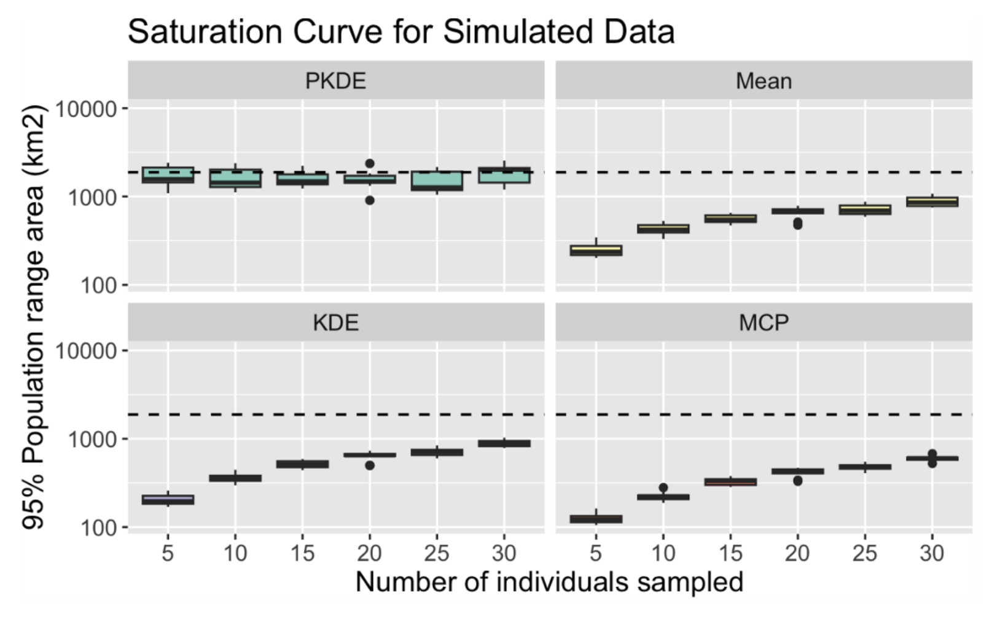

```{r setup, include=FALSE}
knitr::opts_chunk$set(echo = TRUE)
```

*Created: 2026-06-30* | *Last updated: `r Sys.Date()`* 

<a href="https://github.com/ctmm-initiative/ctmmlearn.git" class="github-corner" aria-label="View source on GitHub"><svg width="80" height="80" viewBox="0 0 250 250" style="fill:#151513; color:#fff; position: absolute; top: 0; border: 0; right: 0;" aria-hidden="true"><path d="M0,0 L115,115 L130,115 L142,142 L250,250 L250,0 Z"></path><path d="M128.3,109.0 C113.8,99.7 119.0,89.6 119.0,89.6 C122.0,82.7 120.5,78.6 120.5,78.6 C119.2,72.0 123.4,76.3 123.4,76.3 C127.3,80.9 125.5,87.3 125.5,87.3 C122.9,97.6 130.6,101.9 134.4,103.2" fill="currentColor" style="transform-origin: 130px 106px;" class="octo-arm"></path><path d="M115.0,115.0 C114.9,115.1 118.7,116.5 119.8,115.4 L133.7,101.6 C136.9,99.2 139.9,98.4 142.2,98.6 C133.8,88.0 127.5,74.4 143.8,58.0 C148.5,53.4 154.0,51.2 159.7,51.0 C160.3,49.4 163.2,43.6 171.4,40.1 C171.4,40.1 176.1,42.5 178.8,56.2 C183.1,58.6 187.2,61.8 190.9,65.4 C194.5,69.0 197.7,73.2 200.1,77.6 C213.8,80.2 216.3,84.9 216.3,84.9 C212.7,93.1 206.9,96.0 205.4,96.6 C205.1,102.4 203.0,107.8 198.3,112.5 C181.9,128.9 168.3,122.5 157.7,114.1 C157.9,116.9 156.7,120.9 152.7,124.9 L141.0,136.5 C139.8,137.7 141.6,141.9 141.8,141.8 Z" fill="currentColor" class="octo-body"></path></svg></a><style>.github-corner:hover .octo-arm{animation:octocat-wave 560ms ease-in-out}@keyframes octocat-wave{0%,100%{transform:rotate(0)}20%,60%{transform:rotate(-25deg)}40%,80%{transform:rotate(10deg)}}@media (max-width:500px){.github-corner:hover .octo-arm{animation:none}.github-corner .octo-arm{animation:octocat-wave 560ms ease-in-out}}</style>

---

## Learning Objectives

By the end of this module you will be able to:

1. Estimate a home range using autocorrelated kernel density estimation (AKDE).
2. Account for issues that may bias home range estimation.
3. Perform a meta-analysis to estimate mean home-range parameters across individuals.
4. Estimate a population range distribution using autocorrelated kernel density estimation (PKDE).

**Packages used:** `ctmm`

---

## Background

A **home range** is the area repeatedly used throughout an animal’s lifetime for all its normal behaviors and activities, excluding occasional exploratory excursions. A home range should encompass the space needed for past, present, and future movement, under the same range resident behaviors. Home-range estimation is often a key step to formulating or amending conservation policy as it can map out important habitat areas and resources used by animals during significant portions of their lifetimes. While the concept of a home range may seem straightforward, many different methods have been developed in attempt to quantify individual home ranges from animal tracking data. 

It is also important to note that not all animals exhibit range residency, and some may switch between range resident and transient or transitory behaviors (e.g., migrating between seasonal ranges, or dispersing to settle away from their natal range). Although this transitory movement may be an integral behavior, it is best modeled separately from range resident behaviors, as it generally does not constitute part of an individual's home range. Thus, it is important to ensure that we define an animal's home range and estimate it in a systematic manner. This module will walk through the standard workflow for range estimation under the continuous-time framework, where we will model individual home ranges, extract mean parameter estimates via meta-analyses of home ranges, and estimate population ranges.

## Data Preparation

We will use our data on 6 GPS-tracked African buffalo (*Syncerus caffer*) to demonstrate continuous-time home-range estimation, first using the single individual, Pepper, to estimate an individual home range, then with all 6 buffalo for home range meta-analysis and population range estimation.

### Import and Visualize Data

```{r import_data}

# Load ctmm package
library(ctmm)

```

The main function we will be working with for range estimation is `akde` for **autocorrelated kernel density estimator (AKDE)**, which is a *kernel density estimation (KDE)* method with a debiasing adjustment, as it is conditioned on the selected autocorrelation model. KDE is nonparametric, so we are estimating without assuming a known model and its parameters. By default, KDE puts equal weights on all points; however, for AKDE, the weights can be optimized, such that less weight is given to over-sampled points and more weight is given to under-sampled points. Additionally, if you have tracked multiple individuals and wish to estimate a population-wide range, you may use the `pkde` function (*more to come*).

KDE also requires the bandwidth (smoothing parameter, $h$) to be optimized, which is performed via the `bandwidth` function called internally to the `akde` function. The bandwidth determines the spread of the kernels that are placed. Note that we do not set the bandwidth, because there is no true value of $h$ that best characterizes an animal. This is a parameter that is optimized using a Gaussian optimization function, given the data and movement model. We can, however, set boundaries by including shape files (.shp), if the kernels spill over into areas where the animal cannot go (e.g., a fish on land).

```{r import_data2, eval = FALSE}

help("akde") # main function and new `pkde()` function for population-wide data
## less weight on over-sampled points and more weight on under-sampled points 
## (number of weights (optimization parameters) = number of data points)

help("bandwidth")  # bandwidth = spread of kernels

```

As before, let's follow the data preparation and visualization process for a single buffalo, Pepper.

```{r import_data3}

# Load buffalo data
data(buffalo)
projection(buffalo) <- median(buffalo)  # center projection on median of locations

names(buffalo)

# Here we will work with Pepper
DATA <- buffalo$Pepper

COL <- color(DATA, by = "time")  # color location points by time
plot(DATA, col = COL, main = "Pepper")

# This dataset has problems
dt.plot(DATA)  # diagnose sampling schedule
## time intervals in data sorted by size, 
## most of the sampling intervals are 2 hours, some greater, some around 1 hour

```

We can check the sampling schedule for irregularities using the `dt.plot` function, which plots the intervals at which data was recorded in a sorted index. Based on this plot, we can diagnose whether the data was recorded under a consistent, desired sampling regime (e.g., recorded once every hour), in which case we would see a flat line, or if there are potential periods that were over-sampled relative to others. Here, we can see that Pepper's sampling schedule did not follow a consistent 1-hour interval. In fact, much of her data was collected at a 2-hour interval, while some was collected at even greater time intervals. This is because Pepper's collar malfunctioned part-way through the study. Irregular sampling is one of the issues that can be accounted for under the continuous-time modeling framework.

### Model Selection

Here, we will select the best autocorrelation movement model for Pepper's data, as well as fit an IID model that assumes independent data points to compare the AKDE to the regular KDE. Note that you want the best model for each individual, even if that differs by individual. Different movement behaviors and sampling schedules will reveal different autocorrelation structures in the data.

> Before model selection, it is always a good idea to **check the variogram** for each individual to ensure that they satisfy the assumption of range residency. 

If you animal is not range resident, then the AKDE may not provide a very good estimate of space use, as it targets home-range estimation. If your animal switches between transitory movement behaviors (e.g., migration, dispersal, directed path reuse) and range residency, it would be best to segment your data, such that the range resident and transitory portions are modeled separately.

```{r ctmm.select, eval = FALSE}

# Selected autocorrelation model
GUESS <- ctmm.guess(DATA, interactive = FALSE)
FIT <- ctmm.select(DATA, GUESS, trace = 3)
save(FIT, file = "data/pepper.rda")

```

```{r ctmm.select2}

# Load saved model selection results
load("data/pepper.rda")

summary(FIT)
## velocity autocorrelation ~ 30-40 mins
## position autocorrelation ~ 7-24 days

# Analogous IID model
IID <- ctmm.fit(DATA)

summary(IID)

```

## Home Range Estimation

### AKDE

**Kernel density estimation (KDE)** is a method traditionally used for home-range estimation, as it is a statistically efficient non-parametric distribution estimator that describes both the home range area (borders) and the intensity of space use, visualized through the probability density. KDEs assume locations are independent ($n=N_{ESS}$), when in reality, it is often the case that the data is autocorrelated and thus, $n\gg N_{ESS}$. If used without considering autocorrelation, the KDE will underestimate the home range, and may result in overconfidence in the results. To satisfy the assumption of independence, researchers must thin their data until they are statistically independent, so that a KDE can be used.

> But why intentionally discard data that was costly to collect?

Here, we emphasize that a better solution to the challenges of home-range estimation is to use **autocorrelated kernel density estimation (AKDE)**. AKDE is a KDE-based method that explicitly assumes the data represents a sample from an *autocorrelated, continuous movement process*. AKDE predicts a range distribution that represents the **home range** space used by an animal, given that they maintain the same behaviors. This method provides accurate confidence intervals at levels specified by the user (e.g., 50% CI or 95% CI) that help determine when there are insufficient data to provide a "good" home range estimate. In cases where data do not provide sufficient information, the home range estimate confidence intervals will be much wider. Note that an AKDE conditioned on an IID model is equivalent to a regular KDE, as it does not consider autocorrelation.

```{r akde}

# Regular KDE
KDE <- akde(DATA, IID)  # with IID model
## Anisotropic kernel

plot(DATA, KDE, main = "KDE")
summary(KDE)

```

Based on the plot of Pepper's tracking data, we would want elongated kernels here (anisotropic) instead of symmetric kernels, because the distribution of her tracking data appears uneven and elongated. Let's fit an AKDE with the selected OUF anisotropic model and visualize our estimate of her home range.

```{r akde2}

# Default AKDE
AKDE <- akde(DATA, FIT)  # with selected autocorrelation model (OUF anisotropic)

# Plot the home range
plot(DATA, AKDE, main = "AKDE")
summary(AKDE)
## Larger point estimates and CIs

```

We can interpret a KDE-based figure like a 3-dimensional histogram, where the darker colors represent more probability density of space use and the contours represent the confidence levels of the estimate specified by the user (e.g., 95% point estimate and CIs). Here, we can see that the AKDE point estimate of the home range is a much larger area than that estimated by the KDE, and it has a larger grid, representing the scale and orientation of bandwidth. The AKDE confidence intervals are also wider due to lower effective sample size, while the KDE is assuming that the absolute sample size is the ESS, thus being overconfident in the estimate (can barely see the CIs due to high assumed certainty from DOF[area]). If we were to continue collecting more data for Pepper, we would very likely see that the KDE does not capture 95% of her tracked locations, while the AKDE remains more robust.

### Weighted AKDE (wAKDE)

Remember the "dt.plot" we examined earlier? Pepper's sampling schedule was not uniform and even, so we need to optimally weight our AKDE. An unweighted AKDE places too much probability density on over-sampled times. The weighted AKDE (wAKDE) mitigates unrepresentative sampling in time. Irregular sampling can either be intentional (e.g., duty-cycling devices to record more frequently at certain periods of activity) or result from actual problems (e.g., device malfunction, habitat-related signal loss, etc.). In Pepper's case, her GPS collar malfunctioned and began recorded irregularly, often at a 2-hour interval rather than the desired 1-hour interval. 

The wAKDE optimally upweights location points that occur during under-sampled times and downweights location points that occur during over-sampled times. If there are large gaps in the weights of data, the higher-weighted/more unique data points are more valuable as they contain more unique information. For Pepper, we would be giving more weight to the 1-hour sampled points, because the resulting wAKDE would be a more representative visualization of movement data rather than the sampling itself.

```{r wakde}

# Optimally weighted AKDE
wAKDE <- akde(DATA, FIT, weights = TRUE)
## Only needed for irregular sampling - can be slow

# Pepper's optimal weights
plot(DATA$timestamp, wAKDE$weights, 
     xlab = "time", ylab = "weight", main = "Optimal Weights")

# Zoom into the lower weights
plot(DATA$timestamp, wAKDE$weights, ylim = c(0,0.005),
     xlab = "time", ylab = "weight", main = "Optimal Weights (zoomed in)")
## More weight ascribed to 2 hour data

# Pepper's sampling interval
plot(DATA$timestamp, 'hour' %#% c(0, diff(DATA$t)), ylim = c(0,20),
     xlab = "Date", ylab = "Sampling interval (hours)", main = "Pepper's Sampling Intervals")

```

We can see that Pepper's sampling interval became more irregular and stopped its 1-hour sampling some time around late May to early July. This is also around the timestamp when we start seeing larger weights being assigned to location points. Overall, more weight appears to be ascribed to the 2-hour sampled points. As the wAKDE can be slower than a uniformly-weighted AKDE, it may not be necessary to use optimal weighting if your data is not very irregular.

Let's visualize how the 3 distributions compare. For each, note the CIs, grid, etc...

```{r wakde2}

# Match extent for plotting to the largest of the three distributions
EXT <- extent(list(KDE, AKDE, wAKDE))

# Plot the IID KDE
plot(DATA, KDE, ext = EXT, main = "Regular IID KDE")
summary(KDE)

# Plot the AKDE
plot(DATA, AKDE, ext = EXT, main = "Uniformly-weighted AKDE")  # uniform weights
summary(AKDE)

# Plot the weighted AKDE
plot(DATA, wAKDE, ext = EXT, main = "Optimally-weighted AKDE")  # optimal weights
summary(wAKDE)

```

Let's compare the 3 distributions more directly by overlaying them. We will also create custom coloring for our location points, so that points with ~1-hour sampling are yellow, those with ~2-hour sampling are red, and all others are a shade of gray. By coloring our points by the sampling interval, we will be able to better see which parts of the data correspond to differences between the AKDE and wAKDE. For the purpose of seeing the data points, 95% contours, and 50% core areas, we will keep the distribution densities transparent and we will not plot the confidence interval bounds.

```{r wakde3, warning = FALSE}

# Create custom colors for data by sampling interval
DATA$interval <- "hour" %#% c(3600, diff(DATA$t))  # sampling intervals
DATA$color <- NA  # empty column to fill with colors

DATA$color[0.94 < DATA$interval & DATA$interval < 1.05] <- "gold"  # ~1-hour sampling
DATA$color[1.85 < DATA$interval & DATA$interval < 2.15] <- "red2"  # ~2-hour sampling
DATA$color[DATA$interval > 2.5] <- "darkgray"        # >2 hours
DATA$color[DATA$interval < 0.94] <- "lightgray"      # <1 hour

# Plot all distributions overlayed
plot(DATA, KDE, ext = EXT, col = DATA$color, level.UD = c(0.5,0.95), level = NA,
     col.level = "gray", col.grid = NA, col.UD = "transparent", 
     main = "Overlayed KDE, AKDE, wAKDE") 
legend("topright", inset = 0.05, legend = c("1-hour", "2-hour", "other"), 
       col = c("gold", "red2", "gray"), bty = "n", pch = 16) 
text(-22, 68, labels = "KDE", col = "gray") 
text(19, 50, labels = "AKDE", col = "blue") 
text(-20, 20, labels = "wAKDE", col = "red")
plot(AKDE, ext = EXT, level.UD = c(0.5,0.95), level = NA, col.level = "blue",
     col.grid = NA, col.UD = "transparent", add = TRUE)
plot(wAKDE, ext = EXT, level.UD = c(0.5,0.95), level = NA, col.level = "red",
     col.grid = NA, col.UD = "transparent", add = TRUE)

```

Note how the 95% distribution contour shape and the 50% core area change between the 3 estimators. The IID KDE (<span style="color: gray;">gray</span>) is underestimating the home range area. The AKDE (<span style="color: blue;">blue</span>) and wAKDE (<span style="color: red;">red</span>) perform better, but due to Pepper's irregular sampling, the wAKDE is the best home-range estimator in this case. The 1-hour data is given less weight, while more weight is given to the 2-hour sampling lower down in the distribution. This is particularly noticeable in how the 50% core area for the wAKDE does not contain as much of the 1-hour data as the uniformly-weighted AKDE.

### Over-Smoothing Bias Correction

The Gaussian reference function (GRF) that is used for our AKDEs tends to over-smooth, which can result in overly large distribution estimates. This issue is often masked by the negative bias of unmodeled autocorrelation. By default, all AKDEs produced by `akde` have the over-smoothing bias correction (AKDE$_c$), which is recommended, although it can be turned off by setting `debias = FALSE` as shown below.

```{r osakde, fig.keep = "none"}

# Over-smoothing bias 
osAKDE <- akde(DATA, FIT, weights = TRUE, debias = FALSE)  # no bias correction
## Gaussian reference function akde over-smooths

```

```{r osakde2}

plot(DATA, osAKDE, main = "Uncorrected wAKDE")
## GRF coverage area is too big

```

## Home Range Meta-Analysis

### `ctmm` Meta-Analysis

A **meta-analysis** is a hierarchical model that propagates individual parameters and uncertainties to population-wide estimates. In this section, we will use `meta` to conduct a meta-analysis to compare across individual home ranges and obtain population-level mean parameter estimates, such as the mean of home range area estimates. First, we will need to go through the workflow of home-range estimation for each individual. We demonstrate this with the buffalo below:

```{r meta, eval = FALSE}

help("meta")
help('meta', package = "ctmm")

# Model selection for each buffalo
FITS <- list()
for(i in 1:length(buffalo))
{
  GUESS <- ctmm.guess(buffalo[[i]], interactive = FALSE)
  FITS[[i]] <- ctmm.select(buffalo[[i]], GUESS, trace = 3)
}
names(FITS) <- names(buffalo)
save(FITS, file = "data/buffalo.rda")

# Calculate AKDES on a consistent grid
AKDES <- akde(buffalo, FITS, weights = TRUE)
save(AKDES, file = "data/buffalo_akdes.rda")

```

```{r meta2}

# Load in saved model selection results
load("data/buffalo.rda")

# Load in saved AKDE results
load("data/buffalo_akdes.rda")

# Color individuals to be spatially distinct
COL <- color(AKDES, by = 'individual')
## individuals closer together in space have more distinct colours

# Plot individual AKDEs
plot(AKDES, col.UD = COL, col.level = COL, col.grid = NA, level = NA, 
     main = "African buffalo AKDEs")

```

We will first extract individual home-range estimates and manually calculate the population-level mean (average of mean home range estimates across individuals) and standard error.

```{r meta3}

# Mean buffalo HR "the old way"
AREA <- vector("numeric", length = length(AKDES))  # empty vector to store HR areas

for(i in 1:length(AKDES)) { 
  AREA[i] <- summary(AKDES[[i]], units = FALSE)$CI[2]  # turn off units when making tables (units will be diff)
}
AREA  # vector of HR areas

mean(AREA) # mean
sqrt(var(AREA)/length(AREA)) # SE

```

This process is automated with the `meta` function, which also performs model selection for the population-level parameters. Here, the Dirac-delta population model is selected, but it is singular (no variance/covariance), so we cannot estimate the mean or standard deviation.

The output from the meta-analysis is a forest plot that displays the individual home range estimates and uncertainties, as well as the overall mean of mean home range estimates. If there is a lot of uncertainty surrounding the individual estimates, this is propagated to the population level. We caution about variance overestimation, because it is hard to distinguish sampling error from statistical error. We can force an inverse-Gaussian population distribution to obtain the variance, but since CoV is not a selected feature, it is underestimated.

```{r meta4}

# meta-analysis of buffalo home-range areas
meta(AKDES, col = c(COL,'black'), sort = TRUE)
## Model selection: Dirac-delta > inverse-Gaussian for pop-level parameters

# Force inverse-Gaussian population distribution
meta(AKDES, plot = FALSE, IC = NA)
## Since CoV is not a selected feature, its underestimated here

```

We may wish to use a meta-analysis to compare between groups of individuals in our population or across populations. For example, our 6 buffalo are split into two subgroups based in the North and South.

```{r meta5}

# Compare sub-groups (North vs South don't look significantly different)
BUFFALO <- list(South = AKDES[1:3], North = AKDES[4:6])
META <- meta(BUFFALO)

META
META['South/','/North',]  # ratio of mean southern HR to mean northern HR

```

The North and South subgroups are not significantly different from each other (CIs overlap) in terms of their home range sizes and the ratio of their home ranges.

### `metafor` Package

To perform more general meta-analytic regressions, we can use the `metafor` package. However, `metafor` assumes a normal distribution, and thus, parameter estimates that are strictly positive will need to be log-transformed to be able to use the models in the package. We can first use the `Log` function in `ctmm` to log-transform parameter estimates and their uncertainties, before feeding them to the `metafor` package.

```{r meta6, eval = FALSE}

# General meta-analytic regressions
help("Log")  # log-transform to make estimates more normal for `metafor`

```

For example, we could choose to transform our CTSD mean speed estimates by specifying `variable = "speed"`.

```{r meta7}

# Log-transform speed estimates
Log(FITS, variable = "speed")  # then you can use the 'metafor' R package

```

## Population Range Estimation

For conservation, we are often more concerned with estimating the space needed by a **population** or group of individuals, rather than separate home ranges.

> How can we calculate a population range and the population probability density of space use?

Perhaps, we could just average across the individual distributions? We could use the `mean.UD` function for this. While this method would give the mean of individual densities, it would not model population-level variance.

```{r pkde, eval = FALSE}

# Mean of individual densities doesn't model population variance
help("mean.UD")  # doesn't model population variance
## note the 'sample' argument for correct CIs

```

For example, if we are analyzing a population with different seasonal ranges, or maybe we tracked an individual that switches between nests. In these cases, we may choose to estimate each "home range" separately and then average them.

```{r pkde2}

# Straight mean of HRs - for a population of 6 buffalo
MEAN <- mean(AKDES, sample = FALSE)

plot(buffalo, MEAN, col = COL, main = "Mean African buffalo AKDE")

```

Alternatively, we can estimate a **population-level AKDE (PKDE)**. The [population KDE](https://doi.org/10.1101/2025.09.02.673746) calculates the mean area using a hierarchical meta-analysis model and performs bandwidth optimization after model selection on the hierarchical model. As this process is conditioned on the data and individual AKDEs, it may be slower due to having to perform model selection across parameters from each individual.

```{r pkde3, eval = FALSE}

# Population kernel density estimate (Anand et al., 2025, bioRxiv)
help("pkde")

```

```{r pkde4}

# Estimate population range
PKDE <- pkde(buffalo, AKDES, trace = FALSE)  # runs mean on fitted movement models

plot(buffalo, PKDE, col = COL, main = "African buffalo PKDE")

```

How many individuals do we need to get a population range? Other methods for calculating population ranges tend to underestimate (too small) or require more individuals to be sampled to reach the saturation curve for a population range estimate. While PKDE can result in much larger and more uncertain range estimates, if there is low sampling, it does not bias being too small. Additionally, PKDE estimates saturate rapidly, with shrinking uncertainty and variance as more individuals are sampled. Future work will weight the PKDE by individuals (i.e., downweighting poorly sampled or unrepresentative individuals), akin to the wAKDE for a irregular sampling of a single individual.

<center>
 {width=85%}

<span style="color: gray;"> Validating population space use estimators (PKDE, Mean-AKDE, KDE, MCP) using simulated movement tracks where the true population range area is known (dashed line). The y-axis (95% population range area in square kilometers) is log-scaled, and the x-axis represents the number of individuals sampled to produce the population range estimate. See [Anand et al. (2025)](https://doi.org/10.1101/2025.09.02.673746). </span> </center>

---

## Key functions reference

| Function | Package | Purpose | 
|:---|:---|:---|
| `akde()` | `ctmm` | Calculate a range distribution based on autocorrelated kernel density estimation (AKDE) | 
| `meta()` | `ctmm` | Estimate population-level mean parameters from individual movement models and estimates (meta-analysis) |
| `Log()` | `ctmm` | Log-transform movement parameter estimates and their uncertainties |
| `mean.UD()` or `mean()` | `ctmm` | Average movement models and utilization distributions (occurrence or range) |
| `pkde()` | `ctmm` | Calculate a population-level range distribution based on autocorrelated kernel density estimation (PKDE) |

---

_Next: **Occurrence vs. Range Distributions** — We discuss utilization distributions, common misconceptions about their use, and the difference between occurrence and range distributions._

