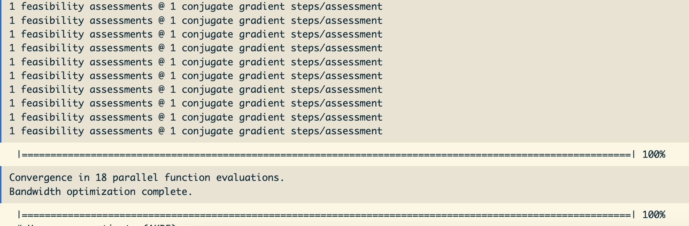
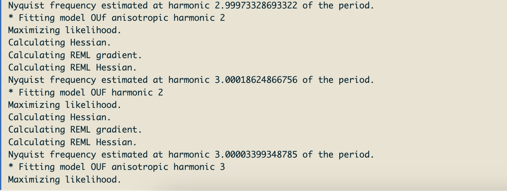

```{r setup, include=FALSE}
knitr::opts_chunk$set(echo = TRUE)
```

*Created: 2026-07-13* | *Last updated: `r Sys.Date()`*

<a href="https://github.com/ctmm-initiative/ctmmlearn.git" class="github-corner" aria-label="View source on GitHub"><svg width="80" height="80" viewBox="0 0 250 250" style="fill:#151513; color:#fff; position: absolute; top: 0; border: 0; right: 0;" aria-hidden="true"><path d="M0,0 L115,115 L130,115 L142,142 L250,250 L250,0 Z"></path><path d="M128.3,109.0 C113.8,99.7 119.0,89.6 119.0,89.6 C122.0,82.7 120.5,78.6 120.5,78.6 C119.2,72.0 123.4,76.3 123.4,76.3 C127.3,80.9 125.5,87.3 125.5,87.3 C122.9,97.6 130.6,101.9 134.4,103.2" fill="currentColor" style="transform-origin: 130px 106px;" class="octo-arm"></path><path d="M115.0,115.0 C114.9,115.1 118.7,116.5 119.8,115.4 L133.7,101.6 C136.9,99.2 139.9,98.4 142.2,98.6 C133.8,88.0 127.5,74.4 143.8,58.0 C148.5,53.4 154.0,51.2 159.7,51.0 C160.3,49.4 163.2,43.6 171.4,40.1 C171.4,40.1 176.1,42.5 178.8,56.2 C183.1,58.6 187.2,61.8 190.9,65.4 C194.5,69.0 197.7,73.2 200.1,77.6 C213.8,80.2 216.3,84.9 216.3,84.9 C212.7,93.1 206.9,96.0 205.4,96.6 C205.1,102.4 203.0,107.8 198.3,112.5 C181.9,128.9 168.3,122.5 157.7,114.1 C157.9,116.9 156.7,120.9 152.7,124.9 L141.0,136.5 C139.8,137.7 141.6,141.9 141.8,141.8 Z" fill="currentColor" class="octo-body"></path></svg></a><style>.github-corner:hover .octo-arm{animation:octocat-wave 560ms ease-in-out}@keyframes octocat-wave{0%,100%{transform:rotate(0)}20%,60%{transform:rotate(-25deg)}40%,80%{transform:rotate(10deg)}}@media (max-width:500px){.github-corner:hover .octo-arm{animation:none}.github-corner .octo-arm{animation:octocat-wave 560ms ease-in-out}}</style>

---

## Learning Objectives

By the end of this module you will be able to:

1. Visualize periodicity in the autocorrelation structure of telemetry data.
2. Use a periodogram to determine potential periodic patterns of space use.
3. Incorporate periodicity into the movement model fitting process.

**Packages used:** `ctmm`

---

## Background

It is known that animals experience periodicity in their activity levels, generally following a regular pattern of having periods of higher activity and periods of rest. However, when studying the behavioral ecology of a species, movement ecologists may also be interested in how periodic activity is expressed in repeated patterns of space use. Many territorial species, large predators in particular will regularly patrol their home ranges. Some species may return to specific feeding sites at regular intervals. These patterns may not always be directly evident when looking at our raw data or typical analyses, such as home-range estimation.

In this module, we will walk through how to calculate and interpret a periodogram for movement data and the process of fitting and selecting a periodic movement model. We will revisit the topic of variograms for assessing autocorrelation (see the "Introduction to CTMM" module ["01_ctmm_intro.rmd"]), and how we can incorporate periodicity into our autocorrelation models.

## Data Preparation

We will be using tracking data for maned wolves (*Chrysocyon brachyurus*), a large canid species native to South America. While it resembles a red fox and is commonly named a wolf, it is actually not closely related to either. This has already been prepared into a telemetry object internal to `ctmm` that can be imported into your `R` environment using the `data` function.

### Import and Visualize Data

```{r import_data}

# Load ctmm package
library(ctmm)

# Import maned wolf data
data(wolf)

# Subset to single individual
DATA <- wolf$Gamba
plot(DATA, col = color(DATA, by = "time"))  # color by time

# Calculate variogram
SVF <- variogram(DATA)
plot(SVF)
plot(SVF, frac = 0.01)  # zoom in to first 20 hours

# Calculate variogram with better confidence intervals
SVF <- variogram(DATA, CI = "Gauss")
plot(SVF)
plot(SVF, frac = 0.01)  # zoom in

```

Remember that there are other tools available for assessing and visualizing autocorrelation in your data. Keep in mind that some provide unbiased estimates of autocorrelation, while others are biased estimators.

```{r autocorrelation, eval = FALSE}

?acf  # or help(acf)
?correlogram  # or help(correlogram)

```

### Model Selection

```{r ctmm.select}

# Guesstimate the autocorrelation parameters
# ctmm.guess(DATA, variogram = SVF)  # interactive mode
GUESS <- ctmm.guess(DATA, variogram = SVF, interactive = FALSE)  # non-interactive mode
plot(SVF, GUESS)  # inspect variogram and model guess parameters
## Note the fluctuations in the autocorrelation

# Model selection
FITS <- ctmm.select(DATA, GUESS, verbose = TRUE, trace = FALSE)  # smaller data set (faster)
## verbose = TRUE to return all models

summary(FITS)  # OUF anisotropic model selected

# Let's look at the best-fit model
summary(FITS[[1]])
plot(SVF, CTMM = FITS[[1]])  # variogram with best-fit model

# Other models
summary(FITS[[2]])
summary(FITS[[3]])

```

### Preliminary Home-Range Estimation

`fast = FALSE` uses exact time spacing and has a computational cost as low as $O(n^2)$, including $O(n^2)$ function evaluations. With `PC="direct"` this method will produce a result that is exact to within machine precision, but with a computational cost of $O(n^3)$. `fast = FALSE, PC = 'direct'` is often the fastest method with small datasets, like here with this maned wolf.

```{r akde}

# Home range estimate (AKDE)
UD <- akde(DATA, FITS[[1]], weights = TRUE, PC = "direct", fast = FALSE, trace = FALSE)

```

<center>



<span style="color: gray;"> Example message output when running `akde` using bandwidth arguments `PC = "direct", fast = FALSE` for small data datasets. To see the output messages reporting convergence progress, set the trace argument to the desired amount of detail (ranging FALSE/0 to 3). The example above is for `trace = 2`. </span> </center> <br>

```{r akde2}

# Plot home range estimate with data
plot(DATA, UD)

# Compare to IID model (assumes independence)
FITS$IID <- ctmm.fit(DATA)

# Regular KDE
UD.IID <- akde(DATA, FITS$IID)  # NOT accounting for autocorrelation
plot(DATA, UD.IID)

# Compare both models
summary(UD)  # much smaller ESS
summary(UD.IID)  # underestimates home range area

```

## Periodogram

Here, we formally introduce the Lomb-Scargle periodogram (`periodogram`), which will help us plot the data in a way that makes periodic patterns apparent. Periodograms decompose the animal location data signal <!--into a waveform of fixed frequencies -->to determine which frequency or frequencies contribute most to the signal. There is an existing vignette available for this function and several papers about [the method](https://doi.org/10.1186/s40462-016-0084-7), as well as [case studies](https://doi.org/10.1002/ecm.1260).

```{r periodogram, eval = FALSE}

vignette("periodogram")

```

The periodogram transforms telemetry data to be able to visualize it as the log(spectral density) as a function of the period (e.g., hourly, daily, monthly, yearly, etc.). There are various arguments in the function that can be used to adjust the algorithm for the data as needed. 

There are two algorithms that can be used. Set `fast = FALSE` to revert to Scargle’s original (slower) algorithm, which involves fewer numerical approximations and is more exact (see [Scargle, 1982](doi:10.1086/160554)). The `fast = TRUE` option uses the much faster FFT-based algorithm, which is better suited for longer datasets, and if `fast = 2`, the FFT algorithm will be used while sampling a highly composite number of times to increase power (see [Péron et al., 2016](https://doi.org/10.1186/s40462-016-0084-7)). The `res.time` argument is used to increase the resolution of the temporal grid when the FFT-based algorithm is used (`fast = TRUE` or `fast = 2`). By default, `res.time = 1`, so the algorithm defaults to adequate resolution for regularly scheduled data (even sampling, while permitting gaps). However, variable sampling rates require `res.time > 1` to resolve the fine-scale spectrum correctly. For the maned wolf data, we will use Scargle's more exact algorithm, while inflating both the frequency and temporal resolution by a multiplier of 2.

```{r periodogram2}

# Calculate Lomb-Scargle periodogram (log spectral density)
LSP <- periodogram(DATA, fast = FALSE, res.time = 2, res.freq = 2)

# Visualize periodic patterns in autocorrelation
plot(LSP, max = TRUE)  # note the spike at the per day mark

```

The `max = TRUE` option above keeps only local maxima and often yields periodograms that are easier to interpret, especially when the resolution of the periodogram has been increased from the default. Important natural periods like the **stellar day**, **synodic month** (full moon phase cycle), and **tropical year** are labeled on the horizontal axes and given dark vertical lines in the plot. **Harmonics** of these natural periods have unlabeled tick marks on the horizontal axis and are are given lighter vertical lines in the plot. The two tick marks under a day represent the *second* and *third* harmonic of the day, or (24/2) 12 hours and (24/3) 8 hours, respectively.

When interpreting the periodogram, look for peaks in the spectral density that could represent a regular pattern in the data at that respective period (x-axis). For example, if an individual patrols a part of their home range each day, we would find a peak at the "day" mark. Peaks at the harmonics of a period indicate that fine details of the periodicity are resolved by the data. To visually assess significance, peaks should be compared to the normal variation around the smooth trend of the periodogram.

```{r periodogram3}

# Compare with the sampling schedule
plot(LSP, diagnostic = TRUE, max = TRUE)
## diagnostic = TRUE plots sampling schedule to help check for artifacts
## max = TRUE plots the local maxima of the periodogram (use only for res > 1)

```

> NOTE: The structure of the sampling schedule may introduce **artifacts** that appear as periodicity. To help determine whether periodogram peaks are representative of a biological process or one that is driven by sampling, we can overlay the periodogram of both and compare. 

Setting `diagnostic = TRUE` overlays the sampling schedule periodogram with red symbols. If the periodogram of the sampling schedule exhibits peaks, this indicates that the corresponding peaks in the movement data could be simply caused by irregularities in the sampling schedule and not by periodicity in the movement. Here, the periodogram exhibits a clear peak for the period of one day, but this is also present in the (red) diagnostic.

Be careful when comparing periodograms across individuals, especially if the aperiodic stochastic movements of these individuals are not the same. Overall, the periodograms is a great, nonparametric tool for exploring patterns in your data, but they may not be able to detect everything. If we do detect potential periodicity, we can switch to a parametric approach to model it by including a parameter for the period. This approach also allows us to model a circulatory process (stochastic component), which is often difficult to identify in the periodogram.

## Fitting a Periodic Movement Model

Once we have determined that there is periodicity in the animal's movement and space use, we can incorporate this into our autocorrelation models to better fit the variogram. We will use the `ctmm` function, which can set specific parameters for the movement models, to allow a:

* **Periodic-mean process:** The mean will follow an oscillatory pattern in the autocorrelation model fit to the variogram. This would represent how an animal reverts to a point that moves periodically through time. Set `mean = "periodic"`.
  * You need to specify one or more period values that you want `ctmm` to consider (`period` argument).
* **Circulation process:** The stochastic (random) component of periodicity that includes a rotational effect. Set `circle = TRUE`.

Since our periodogram showed a peak at the 1 day mark, let's include this in the period, as well as 1 month. These parameters can then be fed into our initial guesses for parameter values through the `CTMM` argument in `ctmm.guess`.

```{r periodic_model}

# Add periodic parameter to model
PROTO <- ctmm(mean = "periodic", period = c(24 %#% "hours", 1 %#% "month"),
              circle = TRUE)
GUESS <- ctmm.guess(DATA, variogram = SVF, CTMM = PROTO, interactive = FALSE)
## Guesstimate with the added periodicity and stochastic circulation parameters

```

```{r periodic_model2, eval = FALSE}

# Periodic movement model selection
PFITS <- ctmm.select(DATA, GUESS, verbose = TRUE, trace = 2)  # return all models
## checks for harmonics
save(PFITS, file = "data/wolf_periodic.rda")

```

<center>



<span style="color: gray;"> Example message output when running `ctmm.select` while estimating a parameter for movement periodicity. Note the parameters being estimated for the model at different harmonics. </span> </center>

```{r periodic_model3}

# Load saved model selection results
load(file = "data/wolf_periodic.rda")

# Model selection results
summary(PFITS)

```

The summary lists the tested models from best-fit to worst-fit. Note that we sort our models differently here (not just by $\Delta$AICc. For a given movement model (e.g., OUF anisotropic), the different non-stationary models (for the harmonics) are sorted by the mean square predictive error (MSPE), not AICc (information criterion). This is because likelihood-based model selection *can* badly overfit with these types of models. For sorting between the movement models (e.g., between OUF anisotropic and OU anisotropic), the information criterion (AICc) is used.

```{r periodic_model4}

# How do the models fit to the variogram?
plot(SVF, CTMM = PFITS[[1]])  # best-fit model
plot(SVF, CTMM = PFITS[[9]])  # OUF anisotropic harmonic 3 1 (poorer fit)

# Selected model
summary(PFITS[[1]])  # OUF anisotropic harmonic 2 1
## Periodic pattern of space use at 1-day mark (daily periodic pattern in movement)

```

The selected model includes the position autocorrelation and velocity autocorrelation (OUF), anisotropy, and **2 harmonics of daily periodicity**. Given how we specified the prototype (`PROTO`), the first number after the harmonic represents the daily periodicity, while the second number represents the monthly periodicity. Therefore, "harmonic 2 1" means that this preferred model has 2 harmonics of the one-day periodicity and 1 harmonic of lunar (monthly) periodicity. 

* **rotation/deviation %:** The proportion of the variance in the animal's **location** that is caused by the periodicity in the mean.
* **rotation/speed %:** The proportion of the variance in the animal's **velocity** that is caused by the periodicity in the mean.
* **circulation period:** The period of the stochastic circulations. On average, what is the period of time (number of months, days, or hours) the animal takes to re-pass through the same areas.

<!--## IGNORE ## If there were some lunar (monthly) patterns, the harmonic would be non-zero for the second value. This matches what we saw in the periodogram. ## CHECK THE LIKELIHOOD FUNCTION: DIFF RESULTS ##-->

```{r periodic_model5}

# Re-fit AKDE for home range
UD_period <- akde(DATA, PFITS[[1]], weights = TRUE, 
                  PC = "direct", fast = FALSE, trace = FALSE)

plot(DATA, CTMM = UD_period)  
## Fairly small difference in the home range
## Would have been hard to notice the periodicity without the periodogram

```

Note that there is very little change in the home range estimate in this case. It would have been difficult to identify the daily patterns in space use without checking the periodogram, as they are not obvious in the raw tracking data. Péron et al. (2016) determined that all 8 individual maned wolves in the full data set patrol their home ranges along daily-repeated routes, a pattern that was otherwise masked by aperiodic stochastic movement.

---

## Key functions reference

| Function | Package | Purpose | 
|:---|:---|:---|
| `variogram()` | `ctmm` | Calculate an empirical variogram from movement data | 
| `periodogram()` | `ctmm` | Calculate the isotropic Lomb-Scargle periodogram of tracking data to visualize periodocities that result from an autocorrelated sampling schedule |
| `plot.periodogram()` or `plot()` | `ctmm` | Visualize the Lomb-Scargle periodogram as log-spectral density over period |
| `ctmm()` | `ctmm` | Fit a hypothetical movement model by specifying the model parameters; only used in this case to specify `mean = "periodic", period = c(24 %#% "hours", 1 %#% "month")` for periodicity and `circle = TRUE` for stochastic circulation to be estimated in `ctmm.guess` and `ctmm.select` |

---

_Next: **Encounter and Interaction Analysis** — We examine methods for investigating potential interactions and encounters between individuals in a population (or across species)._


