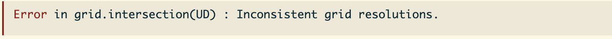

```{r setup, include=FALSE}
knitr::opts_chunk$set(echo = TRUE)
```

*Created: 2026-07-13* | *Last updated: `r Sys.Date()`*

<a href="https://github.com/ctmm-initiative/ctmmlearn.git" class="github-corner" aria-label="View source on GitHub"><svg width="80" height="80" viewBox="0 0 250 250" style="fill:#151513; color:#fff; position: absolute; top: 0; border: 0; right: 0;" aria-hidden="true"><path d="M0,0 L115,115 L130,115 L142,142 L250,250 L250,0 Z"></path><path d="M128.3,109.0 C113.8,99.7 119.0,89.6 119.0,89.6 C122.0,82.7 120.5,78.6 120.5,78.6 C119.2,72.0 123.4,76.3 123.4,76.3 C127.3,80.9 125.5,87.3 125.5,87.3 C122.9,97.6 130.6,101.9 134.4,103.2" fill="currentColor" style="transform-origin: 130px 106px;" class="octo-arm"></path><path d="M115.0,115.0 C114.9,115.1 118.7,116.5 119.8,115.4 L133.7,101.6 C136.9,99.2 139.9,98.4 142.2,98.6 C133.8,88.0 127.5,74.4 143.8,58.0 C148.5,53.4 154.0,51.2 159.7,51.0 C160.3,49.4 163.2,43.6 171.4,40.1 C171.4,40.1 176.1,42.5 178.8,56.2 C183.1,58.6 187.2,61.8 190.9,65.4 C194.5,69.0 197.7,73.2 200.1,77.6 C213.8,80.2 216.3,84.9 216.3,84.9 C212.7,93.1 206.9,96.0 205.4,96.6 C205.1,102.4 203.0,107.8 198.3,112.5 C181.9,128.9 168.3,122.5 157.7,114.1 C157.9,116.9 156.7,120.9 152.7,124.9 L141.0,136.5 C139.8,137.7 141.6,141.9 141.8,141.8 Z" fill="currentColor" class="octo-body"></path></svg></a><style>.github-corner:hover .octo-arm{animation:octocat-wave 560ms ease-in-out}@keyframes octocat-wave{0%,100%{transform:rotate(0)}20%,60%{transform:rotate(-25deg)}40%,80%{transform:rotate(10deg)}}@media (max-width:500px){.github-corner:hover .octo-arm{animation:none}.github-corner .octo-arm{animation:octocat-wave 560ms ease-in-out}}</style>

---

## Learning Objectives

By the end of this module you will be able to:

1. Investigate interactions between individuals using various methods available through `ctmm`:
2. Estimate home range overlap.
3. Calculate pairwise distances and proximity ratios.
4. Estimate encounter rates between individuals and their encounter location distributions (conditional distribution of encounters [CDE])

**Packages used:** `ctmm`

---

## Background

Often, a core reason for tracking animals is to attempt to link individual behavior with higher-level ecological processes. This holds especially true for studying intraspecific and interspecific interactions, from which we can gain a better understanding of processes such as disease transmission dynamics, mating, predator-prey dynamics, and social interactions, among others. Many of these ecological phenomena are governed by how the movement behavior of individuals translates to encounter rates between individuals. We can extend encounter theory to animal tracking and movement modeling in particular, by studying the spatiotemporal relationships between the animals we track. To better examine these relationships, we can model the overlap in space use, as well as spatiotemporal overlap in movement, from which we obtain specific metrics that describe the probability for encounters, which can give rise to interactions.

In this module, we will cover the following methods that can be used for studying interactions between individuals:

* Home-range overlap
* Encounter location distributions (conditional distribution of encounters [CDE])
* Pairwise distances
* Proximity ratios
* Encounter rates

## data Preparation

For this module, we will use the African buffalo (*Syncerus caffer*) telemetry data internal to `ctmm`. We have prepared the data and performed model selection, already. We also estimated the home range (HR) of each individual buffalo, according to the workflow found in Day 3 "Module 3: AKDE, Home Range Meta-Analysis, Population Ranges" ("3_ctmm_akde.rmd"). These results were saved in R data files, which we will load in to prepare for the analyses in this model. This module involves conditional analyses and will use the `simulate` function for demonstration purposes; if interested, you may wish to look ahead at the "Conditional Simulations" subsection in "Module 5: Path Reconstruction & Simulations" for reference.

```{r import_data}

# These analyses are conditional on fitted movement models and HR estimates
# (see: https://github.com/ctmm-initiative/ctmmlearn/blob/main/ctmm_akde.R)
library(ctmm)

# Load buffalo data
data(buffalo)
projection(buffalo) <- median(buffalo)  # center projection on median

# Load in saved model selection results and HR estimates
load("data/buffalo.rda")  # fitted movement models (FITS)
load("data/buffalo_akdes.rda")  # estimated HR areas (AKDES)

```

## Home-Range Overlap

*Do individuals share the same space?*

**Home-range overlap** describes the extent to which a pair of individuals share the same space. We typically quantify home-range overlap by first estimating home ranges from tracking data (i.e., `akde`) and then applying an overlap metric to the range estimates. The default overlap estimator in `ctmm` is a bias-corrected version of the Bhattacharyya coefficient (also called Bhattacharyya affinity), which measures the similarity between two probability distributions ([Bhattacharyya, 1946](https://www.jstor.org/stable/25047882)). The `overlap` function calculates the similarity between distributions as the % overlap of the probability mass functions (PMF)<!--probability density functions (PDF)?-->. By using the AKDE-estimated home ranges (HR) to calculate overlap, we are able to overcome the common challenges of differing sampling strategies and underlying movement parameters, such that we can compare across studies, sites, species, and times (see [Winner et al., 2018](https://doi.org/10.1111/2041-210X.13027)).

```{r HR_overlap, eval = FALSE}

help("overlap")  # overlap of distributions

```

An alternative method for calculating overlap (`method = "encounter"`) uses a non-standard measure, that relates to the encounter probability of individuals (see `help(overlap)`). Both the Bhattacharyya coefficient and encounter method calculate a measure that ranges between 0 and 1, where 0 = no shared support (no overlap) and 1 = identical distributions (complete overlap). 

The straight geometric overlap depends on the % range contour chosen (usually 95%) and does not consider the frequency or intensity of of space use. Because ranges tend to look more dissimilar than they are, there is a tendency for underestimation of overlap. The `overlap` function has a bias correction to account for this.

```{r HR_overlap2}

# Estimate HR overlap for all pairs
OVER <- overlap(AKDES)  # statistical measure of overlap with bias correction
## Things tend to appear more dissimilar, so overlap is underestimated w/out bias correction

```

To use `overlap`, all distributions (i.e., from `akde`) must have compatible resolutions and alignments (calculated on the same grid). This can be facilitated by inputting a list of telemetry objects (all individuals) and the corresponding list of best-fit models (`ctmm.fit`/`ctmm.select` results) in the `akde` function.

```{r HR_overlap3, eval = FALSE}

# Generate an error because of incompatible grids (due to pixel by pixel calculation)
overlap(list(akde(buffalo$Pepper, FITS$Pepper), akde(buffalo$Queen, FITS$Pepper)))
## Do NOT do this!

```



```{r HR_overlap4}

# This works because HRs are estimated simultaneously (and consistently)
overlap(akde(list(buffalo$Pepper, buffalo$Queen), list(FITS$Pepper, FITS$Queen)))
## can also estimate all the AKDEs together first, then feed into overlap

# All overlaps
OVER

```

The overlap function returns an object of class `overlap`, which is a list with elements `DOF` and `CI`. The `DOF` slot contains information on the degrees of freedom of each estimated overlap value, whereas the `CI` slot contains the estimated overlap values and their confidence intervals. Because the Bhattacharyya coefficient is a symmetric measure of overlap (ranging from 0-1), the resulting matrix is also symmetric. To extract overlap values for specific pairs, we can easily pull out of the overlap object either by row/column names, or by their numerical indices. To extract the matrix of the point estimates, subset to the `est` slot within `CI`.

```{r HR_overlap5}

# Pairwise confidence intervals (CIs) 
OVER$CI["Pepper","Toni",]
OVER$CI["Queen","Toni",]

# Point estimates for HR overlap
OVER$CI[,,"est"]

```

> **NOTE:** Home-range overlap does not tell us if animals shared the *same space* at the *same time*. This measure does not directly inform us of whether individual animals are attracted to, or avoid, each other. To address that question, it would be better to calculate pairwise metrics, like **separation distance** and the **proximity ratio** (see "Pairwise Metrics" section below).

## Conditional Distribution of Encounters

*Where encounters are expected to take place?* 

Much of the research in encounter theory has focused on how animal movement relates to encounter rates (*more to come*), leaving a research gap for how animal movement relates to the locations where encounters between individuals may occur. In this section, we will calculate the **conditional distribution of encounters (CDE)** to estimate the areas where animals are likely to encounter each other (while assuming that individuals are moving independently when not encountering each other). 

While home-range overlap is a single number that describes the potential for interactions to occur, the CDE method describes the long-term encounter location probabilities for movement that occurs within home ranges (see [Noonan et al. (2021)](https://doi.org/10.1111/2041-210X.13597)), so that we can determine where we expect majority of encounters to take place. This is presented as a spatially-defined probability density function (PDF), similar to what we calculate for a home range.

```{r CDE, eval = FALSE}

help("cde")  # estimated area of where animals are likely to encounter each other

```

```{r cde2}

# Plot the data and HR estimates
plot(buffalo[c("Pepper", "Queen")], UD = AKDES[c("Pepper", "Queen")],
     col = c("#e76f51", "#264653"), col.UD = c("#f4a261", "#2a9d8f"), 
     col.grid = NA, ylim = c(8000,80000))
## orange = Pepper, green = Queen

# Estimate the home range overlap
overlap(AKDES[c("Pepper", "Queen")])

# Estimate the conditional distribution of encounters (CDE) 
## where we expect majority of encounter to take place
CDE <- cde(AKDES[c("Pepper", "Queen")])  # can weight indivs separately

# Visualize the CDE
plot(buffalo[c("Pepper", "Queen")], UD = CDE,
     col = c("#e76f51", "#264653"), col.UD = "gold2", 
     col.grid = NA, ylim = c(8000,80000))

```

Note how the CDE corresponds with areas where the individual home ranges overlap. This makes sense, because individuals are most likely to encounter each other in the spaces that they share. We caution that any bias in the home-range estimates is propagated to the estimated CDE, because the CDE is estimated directly from the home-ranges areas.

## Pairwise Metrics

As mentioned above, we can use pairwise metrics to investigate whether individual animals are attracted to, or avoid, one another. There are several different functions available in `ctmm` to calculate spatiotemporal relationships between individuals and their movement. In this section, we will discuss pairwise separation distances and proximity ratio.

```{r distances, eval = FALSE}

# Metrics that take time into account (paper coming)
help("proximity")  # ratio to determine if pairwise proximity differs from expectation
help("distances")  # estimate pairwise separation distances
help("difference")  # predict pairwise location differences, given data and ctmm models
help("midpoint")  # predict the midpoints between pairwise locations

```

### Pairwise Distance

We can use the `distances` function to calculate the **pairwise separation distances**, the distance between two individuals at any given time (instantaneous distances). This does not necessarily have to be at timestamps where both individuals have known recorded locations. The distances will be calculated at all timestamps across the pair of individuals.

Let's use Cilla and Mvubu as an example.

```{r distances2}

# Cilla and Mvubu telemetry data
plot(list(buffalo$Cilla, buffalo$Mvubu), col = c("red2", "blue"))
## red = Cilla, blue = Mvubu

```

We can see substantial overlap between these two individuals, so we know they share the same space, but we do not know to what extent they tend to share the same space at the same time. The overlap estimates described above provide no information on spatiotemporal overlap, so we can instead calculate pairwise separation distances. This `distances` output contains the estimated separation distances, the confidence intervals on the estimates, and the timestamps.

```{r distances3}

# Pairwise separation distances
DISTS <- distances(buffalo[c("Cilla","Mvubu")], FITS[c("Cilla","Mvubu")])
## predicts distance btwn 2 individuals at given time

# First 6 entries
head(DISTS)  # dataframe with estimates and CIs at all timestamps
## Includes estimate of potential encounter events

# Visualize the separation distances
plot(DISTS$est ~ DISTS$timestamp, type = "l", col = "#5e548e",
     xlab = "Time", ylab = "Separation Distance (m)",
     main = "Cilla-Mvubu Pairwise Separation Distances")

```

Although the average separation distance across their sampling period is about 3577 m (~3.6 km), we can identify three distinct periods where Cilla and Mvubu were extremely close to one another, versus four periods where they drifted apart.

```{r distances4}

# Internal plotting function [IN DEVELOPMENT]
ctmm:::ts.plot(DISTS)  # work in progress (not yet an exported function in ctmm)

```

Separation distances can provide useful descriptions of the behaviour of pairs of animals, but how do we know if these distances meaningful? Can these distances provide insight into Cilla and Mvubu’s relationship? These distances could mean that they are actively staying close to one another or avoiding one another, however, unless we compare these results to a null model, we cannot make conclusions about their behavior. These observed separation distances could very well be the result of independent movement. To address these questions, we can generate a null model for independent motion via simulation (see `help("simulate")`).

```{r distances5}

# What would totally independent motion look like?
## Simulate independent motion (at same timestamps, without the original data)
cilla_sim <- simulate(FITS$Cilla, t = buffalo$Cilla$t)
mvubu_sim <- simulate(FITS$Mvubu, t = buffalo$Mvubu$t)

# Pairwise distances if independent motion
sim_dists <- distances(list(cilla_sim, mvubu_sim), FITS[c("Cilla","Mvubu")])

```

```{r distances6, fig.height = 7, fig.width = 8}

# Plot the data
par(mfrow = c(2,2))  # plot in 2x2 grid

## Plot real tracking data
plot(buffalo[c("Cilla", "Mvubu")], col = c("red2", "blue"),
     main = "Empirical data")

## Plot simulated tracked locations
plot(list(cilla_sim, mvubu_sim), col = c("red2", "blue"),
     main = "Simulated data")

## Plot empirical pairwise distances
plot(DISTS$est ~ DISTS$timestamp, type = "l", col = "#5e548e",
     main = "Empirical distances", ylab = "Distance (m)", xlab = "Time",
     ylim = c(0,max(sim_dists$est)))

## Plot simulated pairwise distances
plot(sim_dists$est ~ sim_dists$timestamp, type = "l", col = "#5e548e",
     main = "Simulated distances", ylab = "Distance (m)", xlab = "Time",
     ylim = c(0,max(sim_dists$est)))

```

The difference between the resulting separation distances suggests that Cilla and Mvubu are closer together at certain times of year than we would expect from random movement. It is not clear whether these were true encounters, though they did maintain close proximity to each other. 

*But* this conclusion is based off of only one simulated track, which is only one of an infinitely large number of potential paths the animal could have taken. Ideally, you would repeat this process many, many times to obtain an average. We can do this by calculating the pairwise proximity ratio.

### Pairwise Proximity Ratio

The `proximity` function outputs an estimated ratio with confidence intervals. For proximity ratio values:

* **<1** — The two individuals are **closer** on average than expected from independent movement
* **1** — There is no particular relationship between the movement of individuals (consistent with independent movement)
* **>1** — The two individuals are **farther** from each other on average than expected for independent movement

Therefore, if the confidence intervals contain 1, then the distance is *insignificant* with a p-value threshold of 1-level (two-sided) or half that for a one-sided test.

```{r proximity, eval = FALSE}

help('proximity')  # proximity ratio (Note: can be slow)

PROXIMITY <- proximity(buffalo[c("Cilla","Mvubu")],
                       FITS[c("Cilla","Mvubu")])

```

```{r proximity2}

load("data/buffalo_proximity.rda")  
## statistic only works if they are moving tog or actually avoiding each other

PROXIMITY  # >1 = farther apart than each other <1 closer together than expected

```

We can compare this to the proximity ratio calculated from the simulated tracks for independent movement.

```{r proximity3, eval = FALSE}

# Proximity ratio for simulated animals
SIM_PROXIMITY <- proximity(list(cilla_sim, mvubu_sim), FITS[c("Cilla","Mvubu")])

```

```{r proximity4}

load("data/simulated_proximity.rda")

SIM_PROXIMITY

```

## Encounter Rates

As mentioned at the beginning, we can relate many broader ecological processes to animal movement through estimating encounter rates. For example, frequent intraspecific encounters between territorial or competing individuals may results in gradual range shifts to avoid or reduce conflicts over space use (see [Fagan et al., 2023](https://doi.org/10.1101/2023.06.07.544097)).

Note that using proximity as a measure of encounter probability can be sensitive, as it can depend on the threshold distance we choose to set for what is counted as an encounter. Additionally, if data are too coarse, this can miss many potential encounters. Observed separation distances contain information on the number of encounter events (and by extension encounter rates). We can work through this fairly simply by defining an **encounter radius** (threshold distance around individual throughout the sampling period).

```{r encounter, eval = FALSE}

help("encounter")  # encounters, encounter rates/frequencies

```

```{r encounter2}

# Empirical encounters
DISTS$encounter <- ifelse(DISTS$est <= 100, 1, 0)  
## If pairwise distance is less than or equal to 100m, we assume an encounter occurred

# Visualize the results
plot(DISTS$encounter ~ DISTS$timestamp,   # encounters over time
     xlab = "Time", ylab = "Encounter (yes = 1, no = 0)")
cdplot(as.factor(DISTS$encounter) ~ DISTS$timestamp,  # conditional density plot
       xlab = "Time", ylab = "Encounter (yes = 1, no = 0)")
## how does the conditional distribution of encounters change over time

```

From this we can also estimate how many times Cilla and Mvubu encountered one another during the sampling period, as well as their **encounter rate**.

```{r encounter3}

# Empirical Encounter rate (n/day)
n <- sum(DISTS$encounter)  # number of encounters
n
t <- "day" %#% (DISTS$t[nrow(DISTS)] - DISTS$t[1])  # days in the sampling period
n/t  # encounters per day

```

There were 829 estimated encounters between Cilla and Mvubu, which gives us an encounter rate of about 7.8 encounters/day.

However, the choice of 100 m is arbitrary. Because the number of encounters estimated in the data can depend on the size of the encounter radius, it is recommended to perform a sensitivity analysis on the encounter radius value, if you wish to use this type of analysis. The sensitivity analysis will help assess whether the number of encounters changes significantly with varying encounter radius.

```{r encounter4}

# Define a range of distances to test for the encounter radius
enc_rad <- 1:1000

N <- vector("numeric", 1000)  # empty vector to store counted encounters
for(i in 1:length(enc_rad)){
  
  # Encounter occurs if pairwise distance is less than or equal to the encounter radius
  N[i] <- sum(ifelse(DISTS$est <= enc_rad[i], 1, 0))
}

# Visualize the results
plot(N ~ enc_rad, col = "#5e548e", type = "l",
     ylab = "Encounters", xlab = "Encounter radius")

```

As an additional caveat, if a pair of individuals encounter one another, *a single encounter event may persist for some time*. Thus, depending on how finely sampled the data may be, there is the potential for counting a single encounter event as more than one encounter. Therefore, care must be taken when performing an encounter rate analysis.

Alternatively, the `encounter` function in `ctmm` provides a measure of the **relative encounter rates** between individuals. This outputs an `overlap` class object with the `DOF` and `CI` (includes matrices for the relative encounter rate estimates, and low and high confidence interval bounds).

```{r encounter5}

# Estimate relative encounter rates
RATES <- encounter(AKDES, method = "PDF")
RATES  # across all individuals

# Relative encounter rate for Cilla and Mvubu
RATES$CI["Cilla","Mvubu",] * 1000^2  
## good for small distances (spend about 1.2% of their time tog)
RATES$CI["Pepper","Toni",] * 1000^2  

# This transformation can provide a more reliable estimate
tanh(sqrt(RATES$CI["Cilla","Mvubu",]) * 1000)^2
## strong assumption that when they're not together, they're avoiding each other

```

From the ratio of the estimates, we can see that Cilla and Mvubu tend to encounter to one another about three times as often as Pepper and Toni. Keep in mind that these are unitless measures of encounter rates because they are relative to each other.

---

## Key functions reference

| Function | Package | Purpose | 
|:---|:---|:---|
| `overlap()` | `ctmm` | Calculate the overlap between two stationary distributions using the Bhattacharyya coefficient | 
| `cde()` | `ctmm` | Estimate the conditional location distribution of where encounters take place |
| `distances()` | `ctmm` | Estimate separation distances between pairs of individuals, based on their telemetry data and movement models |
| `proximity()` | `ctmm` | Estimate the proximity of two individuals at shared times from their telemetry data and movement models |
| `encounter()` | `ctmm` | Calculate encounter statistics such as standardized encounter probabilities with confidence intervals and encounter rates |

---

_Next: **Path Reconstruction & Simulations** — We predict the most likely path of an individual from its tracking data and selected movement model. We simulate location points and movement models, as well as utilization distributions, conditioned on the data._


