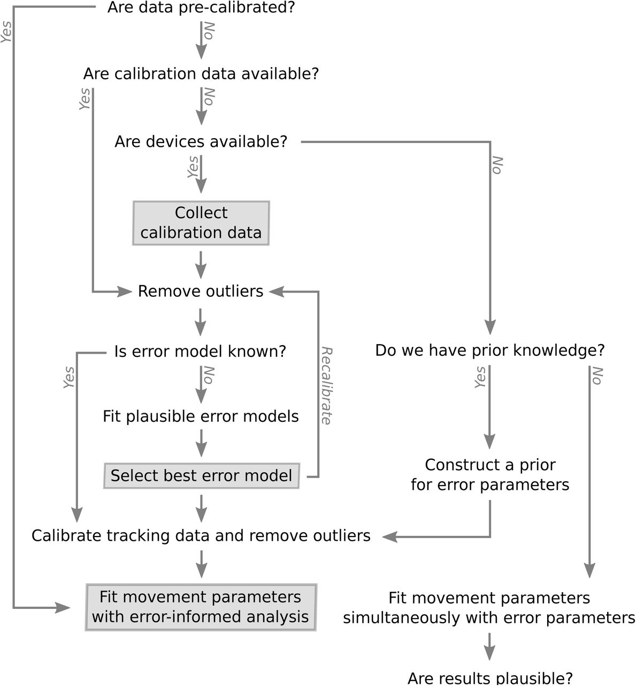
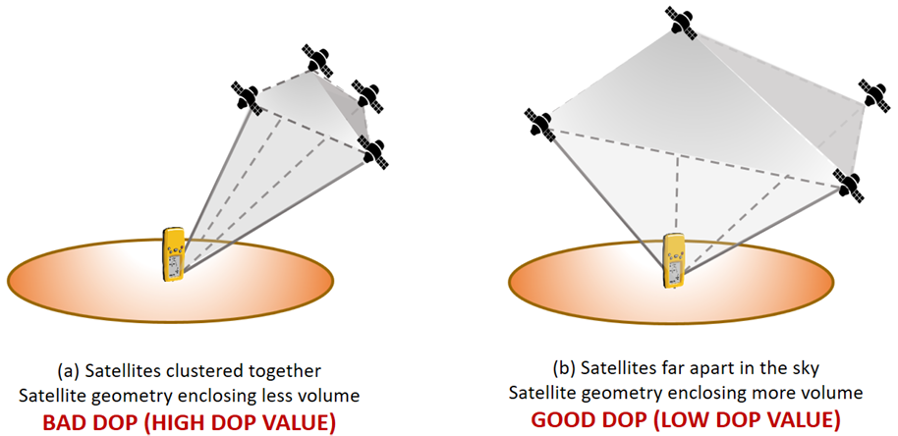
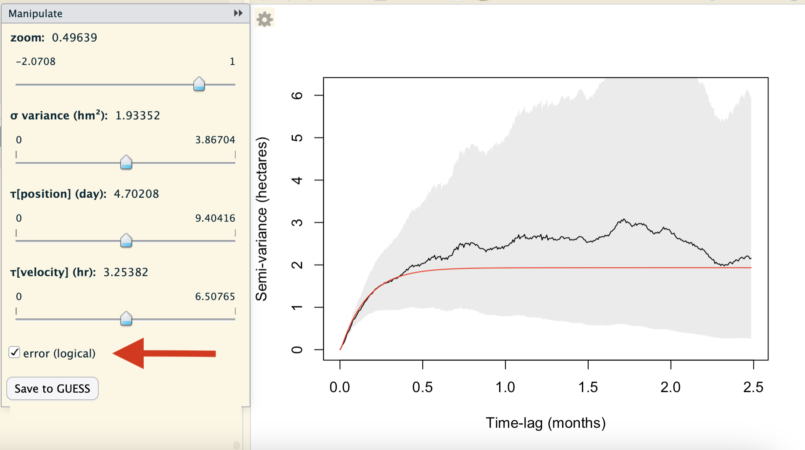

```{r setup, include=FALSE}
knitr::opts_chunk$set(echo = TRUE)
```

*Created: 2026-07-13* | *Last updated: `r Sys.Date()`*

<a href="https://github.com/ctmm-initiative/ctmmlearn.git" class="github-corner" aria-label="View source on GitHub"><svg width="80" height="80" viewBox="0 0 250 250" style="fill:#151513; color:#fff; position: absolute; top: 0; border: 0; right: 0;" aria-hidden="true"><path d="M0,0 L115,115 L130,115 L142,142 L250,250 L250,0 Z"></path><path d="M128.3,109.0 C113.8,99.7 119.0,89.6 119.0,89.6 C122.0,82.7 120.5,78.6 120.5,78.6 C119.2,72.0 123.4,76.3 123.4,76.3 C127.3,80.9 125.5,87.3 125.5,87.3 C122.9,97.6 130.6,101.9 134.4,103.2" fill="currentColor" style="transform-origin: 130px 106px;" class="octo-arm"></path><path d="M115.0,115.0 C114.9,115.1 118.7,116.5 119.8,115.4 L133.7,101.6 C136.9,99.2 139.9,98.4 142.2,98.6 C133.8,88.0 127.5,74.4 143.8,58.0 C148.5,53.4 154.0,51.2 159.7,51.0 C160.3,49.4 163.2,43.6 171.4,40.1 C171.4,40.1 176.1,42.5 178.8,56.2 C183.1,58.6 187.2,61.8 190.9,65.4 C194.5,69.0 197.7,73.2 200.1,77.6 C213.8,80.2 216.3,84.9 216.3,84.9 C212.7,93.1 206.9,96.0 205.4,96.6 C205.1,102.4 203.0,107.8 198.3,112.5 C181.9,128.9 168.3,122.5 157.7,114.1 C157.9,116.9 156.7,120.9 152.7,124.9 L141.0,136.5 C139.8,137.7 141.6,141.9 141.8,141.8 Z" fill="currentColor" class="octo-body"></path></svg></a><style>.github-corner:hover .octo-arm{animation:octocat-wave 560ms ease-in-out}@keyframes octocat-wave{0%,100%{transform:rotate(0)}20%,60%{transform:rotate(-25deg)}40%,80%{transform:rotate(10deg)}}@media (max-width:500px){.github-corner:hover .octo-arm{animation:none}.github-corner .octo-arm{animation:octocat-wave 560ms ease-in-out}}</style>

---

## Learning Objectives

By the end of this module you will be able to:

1. Fit an error model to calibration data and incorporate the error estimates into the telemetry data.
2. Assess the fit of the error model, by checking the residuals.
3. Include error estimates from the calibrated data into movement analyses.
4. Identify outliers in the data that are consistent or inconsistent with the error model.

**Packages used:** `ctmm`

---

## Background

As modern wildlife monitoring technologies allow for fine-scale data collection, we gain more information and have the potential to learn so much more about an animal's ecology and activities. However, this is gain is coupled with challenges and biases of finely-sampled location data, including location error. Location error is error associated with pinpointing the exact location of a tracked animal; essentially the difference between the coordinates provided by the tracking device and the true position. When using devices that relay with the Global Positioning System (GPS) or through other networks (e.g., ARGOS), there will be some uncertainty associated with each recorded location point, due to the configuration of the relay network (i.e., satellites) at that given location and time and potential signal interference (e.g., atmospheric, multipath effects [reflection off other surfaces], obstruction by foliage or weather, etc.). 

Location error was not as large of a concern when data were collected at coarser scales, however, now it is an issue that can heavily bias our results if ignored, especially when tracking smaller species that may not move far between successive timestamps. Rather than discarding data with poorer accuracy or fitting movement and error parameters simultaneously, we propose a framework under CTMM that can account for location error. This has been tested across various species, using 190 GPS, cellular, and acoustic devices, representing 27 models from 14 manufacturers, as described in [Fleming et al. (2020)](https://doi.org/10.1101/2020.06.12.130195).

In this module, we will work through how to handle location error in continuous-time movement analyses, while following the proposed workflow in the following flowchart ([Fleming et al., 2020](https://doi.org/10.1101/2020.06.12.130195)):

<center> <br>

{width=75%} </center> <br>

> **Before beginning:** *Do you need an error model?* 
>
> * How do the scales of error compare to the scales of movement for your study species?
>   * If your species moves very little relative to potential location error, then location error may account for more of the variation in tracked locations than the animal's actual movement.
>   * While it is not always necessary to have an error model for highly-motile animals, it is still important to acknowledge the biases of not accounting for location error. We still recommend calibrating your telemetry data when possible.

> **Do you have calibrated data or calibration data?**
>
> * If you are working with data that has already been calibrated, great! 
> * If the study has not begun yet or you have uncalibrated data, you will want to get calibration data:
>   * Calibration data can be collected (i.e., leaving a device outside to collect locations untouched).
>   * Calibration data can be opportunistic (e.g., data collected after an individual dies and is not moved).
> * Without any calibration data, you should supply a prior for the error parameter, by assigning a range of credible error values. *This is a last resort.*

Note that the calibration data must be collected from the same model device as the tracking data, and their data formatting must be similar enough that the same location classes are detected by `as.telemetry`.

If your data needs calibration... What columns do you have available in your data? Here are some error-related terms that you may see:

* **RMS:** Root-mean-square — statistic that is equivalent to standard deviation in 1 dimension
* **DOP:** Dilution of precision — this is proportional to root-mean-squared (RMS) error.
* **HDOP:** Horizontal dilution of precision — this is proportional to RMS horizontal error, recorded as location error with location class.
* **VDOP:** Vertical dilution of precision — relative measure of RMS vertical error.
* **PDOP:** Position dilution of precision — aggregates HDOP and VDOP.
* **TDOP:** Time dilution of precision — relative measure of RMS temporal error.
* **GDOP:** Geometric dilution of precision — aggregates PDOP and TDOP.
* **UERE:** User equivalent range error — location error after partial standardization using the DOP value
* **Location class:** This is how different devices will categorize/classify locations of different quality. The classes may be specific to the type of data collected (i.e., ARGOS, GPS, telonics, etc.).
  * GPS devices often record different quality location points: 2D, 3D, timed out, etc. Generally it does not matter which class if they are calculated on the same scale, but some companies use different algorithms for 2D vs 3D.

## Data Preparation

We will be using Tom Akre's tracking data on wood turtles (*Glyptemys insculpta*) to walk through how we can calibrate our telemetry data to account for GPS location error in our movement models. When dealing with telemetry (location) error, the DOP columns in your data are important to consider. Depending on the device and species, different error metrics may be recorded and location points may be classified by their quality. For our wood turtle data, we have HDOP (horizontal dilution of precision), which is proportional to the error circle around the recorded location estimate. We will want to make sure that our data’s DOP and error columns import correctly into `ctmm`.

```{r import_data}

# Load ctmm package
library(ctmm)

# Load turtle data
data(turtle)  # or as.telemetry on the turtle data file

names(turtle)  # first two entries are calibration data - not turtles

# Closer look at columns
head(turtle[[1]])
# HDOP: horizontal dilution of precision (want proportionality constant close to 1)
# location class: 3D (or 2D)

```



> **Higher DOP** values mean there is relatively more uncertainty in where the animal was (more location error). This is because the satellites used to position the location were more closely clustered when the location was recorded. Ideally, we would like **lower DOP** values, which mean that there is relatively less uncertainty in the animal's position (less location error), as the satellites were further apart, covering a larger volume of space.

## Fitting an Error Model to Calibration Data

If you have inspected your data and they need to be error-calibrated, or especially if your data have numerous error-related columns, you will need to fit and select an error model. Assuming that our data and information are good, we can use the `uere.fit` function to estimate the RMS User Equivalent Range Error (UERE) parameters of a GPS device. We fit this to our **CALIBRATION** data, not our tracked individuals! The calibration data is used to inform the error model.

```{r uere.fit, eval = FALSE}

help("uere.fit")  # user equivalent range error 

```

```{r uere.fit2}

# Fit error parameters to calibration data (informs error model)
UERE <- uere.fit(turtle[1:2])
## Do NOT run uere.fit on tracking data (use calibration data, not moving turtles)

# Estimated error model parameters
summary(UERE)
## 3D fixes have ~7 at HDOP 1
## 2D fixes have ~ 30 at HDOP 1 (diff scales)

# Apply error model to data
uere(turtle) <- UERE

# Let's take a look at our turtle data now
head(turtle$F231) 

plot(turtle$F231, ylim = c(-650,2300))  
## Error circles at each tracked location accounting for calibration data

```

### Test Which Error Data to Use

_**Question 1:** What if we are unsure about the error data and want to know if HDOP and the location class values are informative?_

Not all GPS devices provide reliable DOP values and sometimes it is not obvious what error information will prove to be the most predictive. Generally speaking, `as.telemetry` will attempt to import the “best” column from among those that estimate error, DOP value, number of satellites and fix type, including timed-out fixes (see the `timeout` argument in `help(as.telemetry)`). Researchers may want to import their data with different error information, run `uere.fit` for each error model, and then select among the candidate models. Here we do this by comparing the turtle calibration data with and without HDOP values.

Let's test fitting an error model to all of our calibration and error data (Attempt 1), and then separately, while first excluding the location classes (Attempt 2: HDOP only), then excluding the HDOP too (Attempt 3: no error data).

```{r uere.fit3}

# Re-load turtle data
data(turtle)

# Make a list to store error models
UERES <- list()

# Attempt 1: let's use everything
UERES$all <- uere.fit(turtle[1:2])
## Do NOT run uere.fit on tracking data

# Summarize Attempt 1 error model
summary(UERES$all)

# Attempt 2: let's drop the location class information
test <- turtle[1:2]  # copy of calibration data

# Delete location class column
test[[1]]$class <- NULL
test[[2]]$class <- NULL
uere(test) <- NULL

# Store error-model fit 
UERES$HDOP <- uere.fit(test)  # HDOP only

# Summarize Attempt 2 error model
summary(UERES$HDOP)  # removing location class data (only HDOP), ~10.6 m error

# Attempt 3: let's drop the HDOP values too

# Delete HDOP column
test[[1]]$HDOP <- NULL
test[[2]]$HDOP <- NULL

# Store error-model fit
UERES$nothing <- uere.fit(test)  # homoskedastic error model

# Summarize error model
summary(UERES$nothing)  # removing HDOP as well (large location error estimate)

# Compare error models
summary(UERES)  # AICc selects model with all error parameters
## But all have poor Z[red]^2 values because the HDOP values aren't great

```

Here, the selected model, based on $\Delta$AICc and the $Z_{[red]}^2$ statistic, is the model with all error parameters (including both location class and HDOP).

The reduced $Z^2$ statistic is a measure of the goodness of fit for trends. This can be compared to the reduced $\chi^2$ statistic, where $\chi^2 = 1$ is a good regression, $\chi^2 <1$ suggests overfitting (suspicious, too good), and $\chi^2 >1$ suggests underfitting (bad). <br>

_**Question 2:** Are these GPS tags identical?_

We had two calibration data sets, so we can also see if there is any substantial difference between the two GPS tags. We do this by making a list of individual UERE objects (one per tag/calibration data set) and compare to the previous joint UERE model (`UERES$all`).

```{r uere.fit4}

# Create a list to store individualized error models
indiv <- list()

# Calculate individual UEREs for each GPS tag
indiv[[1]] <- uere.fit(turtle[[1]])  # tag 1
indiv[[2]] <- uere.fit(turtle[[2]])  # tag 2

# Compare calibration parameters
summary(UERES$all)  # joint model
## ~7m error for 3D, ~30m for 2D
summary(indiv[[1]])  # but pretty similar if fit separately
summary(indiv[[2]])

# Store individual models with joint models
UERES$indiv <- indiv

# Compare individual to joint models
summary(UERES)

```

In this case, performances of the individualized and joint error models are comparable, and AICc selects the joint model. However, be careful of trusting AICc here, because it will likely just pick the more complex model. There is a low $\Delta$AICc and similar $Z_{[red]}^2$ values between individual and joint models, so the joint model does not actually improve much over the individual models.

### Calibrate Telemetry with Error Model

Now that we have fit our error models and selected the best one, we can calibrate our actual turtle tracking data with this model. We do so by assigning the error model to be the UERE of the data set, which transforms the HDOP values into absolute errors.

```{r assign_error}

# Calibrate turtle data with best error model
uere(turtle) <- UERES$all  # assign error model to be the error of dataset

# Error columns now in data
head(turtle[[1]])
## also now includes a per-time error estimate (error circle)

# We can now see error in individual turtle movement
plot(turtle[[1]])  # calibration data (device not moved)
## a lot of the variation in the position of the device is explained by error

```

### Checking Model Fit with Model Residuals

We can further check how well the error model fits by examining the model residuals, using the `residuals` function (see `help(residuals)`). Poorly fit error models will show a heavy-tail distribution of the residuals.

```{r residuals}

# Calculate residuals of calibration data with respect to BEST error model
RES <- lapply(turtle[1:2], residuals)  # apply function over items in list

# Plot residuals from best model
plot(RES)  # residuals in red
## Bad error models would give heavy tail

# Calculate residuals of calibration data with respect to WORST error model
uere(test) <- UERES$nothing  # homoskedastic error model
RES2 <- lapply(test, residuals)

# Plot residuals from worst model
plot(RES2)

```

## Error-Informed Movement Analysis

Now that we know how to calibrate our tracking data with an error model fit to our device calibration data, we can apply our location error-informed telemetry data to different types of movement analyses. To demonstrate, we will focus on a single individual in our turtle data, female turtle 231.

```{r outlie}

# Re-load turtle data again
names(turtle)

# Let's focus on female turtle 231
DATA <- turtle$F231

# Plot data
plot(DATA, ylim = c(-650,2300))

```

### Find Outliers

Using error-informed statistics, we can now determine anomalous location points and pick out outliers in our data. The `outlie` function uses error information to estimate straight-line speeds between sampled times and distances from the bulk of the data. High-speed segments are colored in blue, while distant locations are colored in red. More emphasis is placed on the more extreme locations in the `outlie` side effect plot. There is at least one obvious outlier in our turtle data.

```{r outlie2, eval = FALSE}

help('outlie')  # pick out outliers

```

```{r outlie3}

# Look for outliers
OUT <- outlie(DATA)  # side effect plot 
## blue segment = highest speed (used to determine outliers), note larger red points

# Plot outlier information to see deviations
plot(OUT)

# Summary statistics with other useful info
head(OUT)  # error-informed speed and distance estimates

```

We may want to threshold our data to remove outliers based on our knowledge of the animal's speed. Here, we will use a biological threshold to reject all speeds > 5 cm/s, because turtles do not move very quickly. This is where our handy `%#%` units conversion function can be used to convert 5 cm/s to m/s (SI units) that `ctmm` operates with.

```{r outlie4}

# Biological decision to reject all speeds > 5 cm/s for this wood turtle
MAX <- 5 %#% 'cm/s'  # '%#%' convenient units function
MAX  # 5 cm/s in SI units

# Alternatively
MAX <- 0.05 # in meters/second

```

Any data points where speeds are above the threshold speed ("MAX") should be removed because those are unreasonable outliers. It is always good practice to check errors and outliers, because it can sometimes be unclear as to where to delineate threshold. Also, GPS signals may "bounce around" and affect path lengths, giving larger errors than expected.

```{r outlie5}

# Keep good location estimates
GOOD <- OUT$speed < MAX  # keep only data where speeds are less than 5 cm/s
## This is the condition we are setting so that we can subset out data

# Take only good location estimates in out data
DATA <- DATA[GOOD,]  # subset data based on threshold condition

# Re-check data
plot(DATA, ylim = c(-450,420))
OUT <- outlie(DATA)
plot(OUT)

```

Now all the points are similarly distanced from the median and there are multiple quickest movement speeds, rather than a few unreasonably fast speeds. Overall, our turtle data looks more realistic and evenly spread across our outlier plot.

### Model Selection (with Error)

Now that we have cleaned our data, we can proceed with the usual movement modeling process. In this section, we will include error into our autocorrelation model selection process.

```{r ctmm.guess_error, eval = FALSE}

# Guesstimate interactively
ctmm.guess(DATA)
## Check the error box

```

For the interactive `ctmm.guess` mode, there is an option to factor in error by checking the "error (logical)" box, after toggling the gear icon in the top-left corner of the plots panel. Because of some convenient mathematical relations, fitting with telemetry errors involves numerically fitting 1-4 more parameters and is, therefore, slower and less reliable at converging on the MLE than fitting without telemetry error. Therefore, the error is not turned on by default.



When not in the interactive mode, we can include error by setting `error = TRUE` in the `ctmm` function. The `CTMM` argument in `ctmm.guess` can be used to supply additional parameters through `ctmm()`, such as error, isotropic models, etc.

```{r ctmm.guess_error2}

# Guesstimate non-interactively
GUESS <- ctmm.guess(DATA, CTMM = ctmm(error = TRUE), interactive = FALSE)
## here error = TRUE

```

If the error is turned on for `ctmm.guess`, then the error models will be used for model selection to find the best fit, while accounting for location error.

```{r ctmm.guess_error3, eval = FALSE}

# Fit models with model selection
FITS <- ctmm.select(DATA, GUESS, verbose = TRUE, trace = 3, cores = -1)
## verbose = TRUE returns all candidate models
save(FITS, file = "data/turtle.rda")

```

```{r ctmm.guess_error4}

# We've already run the model selection for you
load("data/turtle.rda")

# Inspect all models
summary(FITS)
## Location error model turned on

# Best model
summary(FITS[[1]])
## updated error parameter estimates (still similar to what was fed in)

# Compare to prior model (error parameters from calibration)
summary(uere(DATA))

# Compare to movement model without error model 
GUESS <- FITS[[1]]
GUESS$error <- FALSE  # error is not included if set to FALSE
FIT.NE <- ctmm.fit(DATA, GUESS, trace = 2)  # fits quickly w/out error model turned on

summary(FITS[[1]])$CI  # with error model

```

Including the error model in our movement analyses not only accounts for location error, but also allows us to compare across data sets or studies that use different GPS tags/devices.

```{r ctmm.guess_error5}

summary(FIT.NE)$CI  # without error model
## Without error model, we assume all of the variation is explained by animal movement

```

If error is not included, we would get larger home-range estimates, as it is assumed that all the variation is explained by the animal's movement, rather than potential location error. We would also get larger movement rates, when some of the "jittering" of the data should actually be explained by location error. In reality, some of the variation in the animal's position is attributed to GPS location error (due to the device/equipment), while some of the variation is due to actual animal movement (biological).

### Predicting from Models that Include Error

```{r predict, eval = FALSE}

help('predict', package = "ctmm")

```

We can "smooth" out our turtle locations by predicting from the movement model to add interpolated location points to our observed data. These predictions are Kriged location estimates. The updated estimates have error ellipses, rather than error circles. We can also simulate tracking data, conditioned on our data and movement (and error) model.

```{r predict2}

# Smoothed data to update
SMOOTH <- predict(DATA, FITS[[1]])
## Removes some error because it feeds in the movement model

plot(DATA, ylim = c(-450,420))
plot(SMOOTH, ylim = c(-450,420))  # updated estimates of turtle locations
## uses error ellipses, not circles

# Simulate based on movement + error model
SIM <- simulate(DATA, FITS[[1]])
plot(SIM)

```

## No Calibration Data? Supply a Prior

If you do not have calibration data, an alternative method (last resort) is to simply assign a range of credible RMS UERE values to the data. In this case, you are supplying a prior (prior belief about the system) under a Bayesian modeling framework. 10-meter error is usually a good guess for 3D GPS data. For e-obs, and other devices that report error in meters, a number on the order of 1 is usually more relevant.

```{r prior}

# Re-load the un-calibrated data
data(turtle)

# These data have two location classes: 2D & 3D
## need to match this class structure
summary(uere(turtle))  # guesses for error (10m)

# Supply point estimates (assign numbers to error)
## 20-meter 2D error at HDOP=1
## 10-meter 3D error at HDOP=1
uere(turtle) <- c(20,10)

# Extract calibration object
PRIOR <- uere(turtle)

summary(PRIOR)  # the default uncertainty when assigning numerical error is zero
PRIOR$DOF  # will also need to set DOF, currently infinite

```

Before we can assign this calibration prior to our data, we also need to assign the degrees of freedom (effective sample size) for our HDOP. Here, we will set the DOF to 2, such that error is effectively worth 2 data points, which should give wide credible intervals. This prior for our error parameter will be updated when fitting the movement models.

```{r prior2}

# Set DOF for wide credible intervals
PRIOR$DOF[] <- 2  # Bayesian: error is worth 2 data points
summary(PRIOR)  # data calibrated w/ prior (much more uncertainty due to few data points)

# Assign prior to data
uere(turtle) <- PRIOR

```

```{r prior3, eval = FALSE}

# Automated guesstimate for calibrated data
GUESS <- ctmm.guess(turtle[[3]], CTMM = ctmm(error = TRUE), interactive = FALSE)
FIT.PRIOR <- ctmm.select(turtle[[3]], GUESS, trace = 3, cores = -1)
## This will take a while, but comes out consistent
save(FIT.PRIOR, file = "data/turtle-prior.rda")

```

```{r prior4}

load("data/turtle-prior.rda")  # load saved model selection results

summary(FIT.PRIOR)  # using prior and updating it

# Compare update to prior
summary(PRIOR)

```

Our error estimates were further updated due to the larger effective sample size of the actual data (see DOF), with the estimate for 2D-class error increasing to ~50 from 20, while the 3D-class estimate decreased slightly. While having a prior is better than nothing, you should not use this method as a substitute for actual calibration data. You may even find that the same prior is returned regardless of updates, as that is the best you can get. We emphasize that using a prior is a last resort to adding an error model if you do not have calibration data. Be cautious with how you handle location errors, as this may affect downstream analyses. When in doubt, refer to the proposed workflow in the "Background" section above.

---

## Key functions reference

| Function | Package | Purpose | 
|:---|:---|:---|
| `uere.fit()` | `ctmm` | Fit error parameters to GPS calibration data to estimate the root-mean-square User Equivalent Range Error (UERE) of a GPS device | 
| `uere()` or `uere()<-` | `ctmm` | Assign the UERE error model to telemetry data |
| `residuals()` | `ctmm` | Calculate model fit residuals and assess their autocorrelation |
| `ctmm()` | `ctmm` | Fit a hypothetical movement model by specifying the model parameters; only used in this case to specify `error = TRUE` for the error model to be incorporated in the `ctmm.guess` function |
| `outlie()` | `ctmm` | Detect outliers in telemetry data, informed by an error model, by highlighting potential speed and distance outlier (or anomalous) points |

---

_Next: **`ctmm`-Based Habitat Selection** — We will examine the habitat preferences (or avoidances) of individuals through habitat selection analysis with integrated resource selection functions (iRSFs) and incorporate habitat selection into home range analysis for improved range estimates (iRSF-AKDE)._


