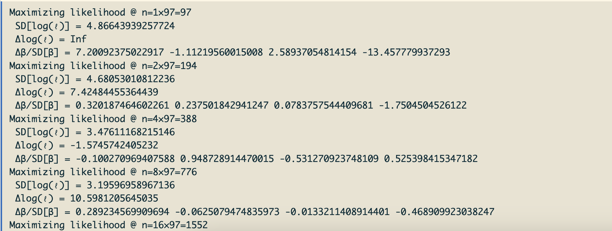

```{r setup, include=FALSE}
knitr::opts_chunk$set(echo = TRUE)
```

*Created: 2026-07-13* | *Last updated: `r Sys.Date()`*

<a href="https://github.com/ctmm-initiative/ctmmlearn.git" class="github-corner" aria-label="View source on GitHub"><svg width="80" height="80" viewBox="0 0 250 250" style="fill:#151513; color:#fff; position: absolute; top: 0; border: 0; right: 0;" aria-hidden="true"><path d="M0,0 L115,115 L130,115 L142,142 L250,250 L250,0 Z"></path><path d="M128.3,109.0 C113.8,99.7 119.0,89.6 119.0,89.6 C122.0,82.7 120.5,78.6 120.5,78.6 C119.2,72.0 123.4,76.3 123.4,76.3 C127.3,80.9 125.5,87.3 125.5,87.3 C122.9,97.6 130.6,101.9 134.4,103.2" fill="currentColor" style="transform-origin: 130px 106px;" class="octo-arm"></path><path d="M115.0,115.0 C114.9,115.1 118.7,116.5 119.8,115.4 L133.7,101.6 C136.9,99.2 139.9,98.4 142.2,98.6 C133.8,88.0 127.5,74.4 143.8,58.0 C148.5,53.4 154.0,51.2 159.7,51.0 C160.3,49.4 163.2,43.6 171.4,40.1 C171.4,40.1 176.1,42.5 178.8,56.2 C183.1,58.6 187.2,61.8 190.9,65.4 C194.5,69.0 197.7,73.2 200.1,77.6 C213.8,80.2 216.3,84.9 216.3,84.9 C212.7,93.1 206.9,96.0 205.4,96.6 C205.1,102.4 203.0,107.8 198.3,112.5 C181.9,128.9 168.3,122.5 157.7,114.1 C157.9,116.9 156.7,120.9 152.7,124.9 L141.0,136.5 C139.8,137.7 141.6,141.9 141.8,141.8 Z" fill="currentColor" class="octo-body"></path></svg></a><style>.github-corner:hover .octo-arm{animation:octocat-wave 560ms ease-in-out}@keyframes octocat-wave{0%,100%{transform:rotate(0)}20%,60%{transform:rotate(-25deg)}40%,80%{transform:rotate(10deg)}}@media (max-width:500px){.github-corner:hover .octo-arm{animation:none}.github-corner .octo-arm{animation:octocat-wave 560ms ease-in-out}}</style>

---

## Learning Objectives

By the end of this module you will be able to:

1. Use telemetry data, a home range estimate, and raster data to fit an integrated resource selection function (iRSF) with autocorrelation-based weight adjustment.
2. Build a habitat suitability map from the fitted iRSF.
3. Produce RSF-informed home range estimates.

**Packages used:** `ctmm`, `raster`

---

## Background

To better understand the ecology of a species, and so that we may better conserve it, movement ecologists often investigate the habitat selection of individuals and what drives their movement or where they choose to establish their home ranges. What environmental features do animals prefer or avoid, and how does seasonality or resource availability impact an individual's space use? How about human disturbance or climate change?

The habitat selection process can occur at different levels. [Johnson (1980)](https://doi.org/10.2307/1937156) proposed 4 hierarchical orders of selection:

* **First-order selection:** physical or geographical range of the distribution of the species
* **Second-order selection:** drivers of home range selection for an individual or group (i.e., social group or colony)
* **Third-order selection:** features and elements within a home range that determine specific areas of usage (e.g., a feeding site)
* **Fourth-order selection:** items within specific areas of usage (e.g., procurement of food at a feeding site)

A **resource selection function (RSF)** is a parametric method for habitat selection that estimates animal resource use, to address the question of why an animal lives in a certain place. What drives where the animal is located?

**_How does an RSF work?_**

We collect data on habitat covariates that may affect the animal's habitat selection, such as environmental covariates (e.g., land cover, distance to water sources, elevation, etc.) and anthropogenic covariates (e.g., distance to roads, human footprint index, settlements, etc.). We then specify a probability distribution (log link) for a model of habitat selection, where a *positive (+) coefficient means attraction* to resource and a *negative (-) coefficient means repulsion* from resource. This is often interpreted as preference of avoidance of certain resources. Be careful!! If using "distance to XX" covariates, a positive (+) coefficient actually means avoidance of XX (prefers increasing distance to feature), while a negative (-) coefficient means preference for XX (avoids increasing distance to feature).

Here, we advocate for using integrated resource selection functions (iRSFs) that simultaneously estimate availability and resource selection, and also account for autocorrelation in the telemetry data (see [Alston et al., 2022](https://doi.org/10.1111/2041-210X.14025)). Traditional methods can be used as an "approximation" of the more rigorous RSF model. Read up on "spatial point processes" to learn more.

## Data Preparation

Let's first start by importing and visualizing our telemetry data and environmental covariates. We will use tracking data from [Medici (2023)](https://www.doi.org/10.5441/001/1.03ck4s52), available on Movebank, for lowland tapirs (*Tapius terrestris*) in Southern Brazil. We will investigate how tapir locations relate to local tree cover. The raster data for tree cover was obtained from the Hansen forest map based on the Landsat 7 satellite.

### Import and Visualize Data

```{r import_data}

# Load ctmm package
library(ctmm)

# E.P. Medici, Movebank Data Repository (2023)
# Tree cover data from the Hansen forest map based on Landsat 7
load("data/tapir.rda")  # tapir, treecover
summary(tapir)  # 29 individuals
class(treecover)  # RasterLayer (`raster` package)

```

Ideally, we want the telemetry data and environmental data to be in the same projection. Let's plot the two together to check. The `R` argument in the `plot.telemetry` function can be used to add a raster base layer to maps of location data and utilization distributions.

```{r import_data2}

# Let's make sure we have appropriate environmental data & projection
i <- 1
DATA <- tapir[[i]]  # subset tapir 1
projection(DATA) <- median(DATA)  # center projection on median of data

# Plot one tapir with tree cover raster
plot(DATA, error = 2, R = treecover, main = "Lowland tapir under tree cover")
## green = tree cover, white = mostly grassland (possibly wetlands), red = tapirs

```

Here, green represents areas with tree cover, while white indicates areas that are mostly grassland, or possibly wetlands. The red points show the tapir locations with the location error (size of location points). Like with the color of the location points, we can adjust the color of raster layers as well, using the `col.R` argument to specify either a single or suite of colors.

### Model Selection

Note that currently, the `rsf.fit` function in `ctmm` only uses isotropic movement models, so we must specify this using the `ctmm` function. Since we are also using error-calibrated location data, we will also specify for the error model, so the `CTMM` argument in our initial guess will look like: `CTMM = ctmm(error = TRUE, isotropic = TRUE)`.

```{r ctmm.select, eval = FALSE}

# Select an autocorrelation model
## for now, rsf.fit() only uses isotropic models
GUESS <- ctmm.guess(DATA, CTMM = ctmm(error = TRUE, isotropic = TRUE), interactive = FALSE)
FIT <- ctmm.select(DATA, GUESS, trace = 3)
save(FIT, file = "data/tapir-iso.rda")

```

```{r ctmm.select2}

# Load model fit results
load("data/tapir-iso.rda")
summary(FIT)

```

Due to the inclusion of location error in the model, the best-fit movement model was the OUF error model. We will use this to estimate the home range area that will help us calculate our RSF.

## Preliminary Home-Range Estimation

For the iRSF, we will estimate the home range based on the best-fit model, and this will be compared to a regular RSF. The traditional RSF is a discrete-time model that assumes independent (IID) location points, so for this, we will fit a regular KDE (isotropic).

```{r akde}

# AKDE (without RSF)
AKDE <- akde(DATA, FIT, weights = TRUE)  # wAKDE

# Plot AKDE with tree cover base map
plot(DATA, error = 2, UD = AKDE, R = treecover, col.grid = NA, main = "AKDE")
## independent of covariates (not considering preference for/against tree cover)

# Fit IID model for comparison
IID <- ctmm.fit(DATA, CTMM = ctmm(isotropic = TRUE))
KDE <- akde(DATA, IID)  # regular KDE

```

## Integrated Resource Selection Function (iRSF)

### Fitting an RSF

We can use the `rsf.fit` and `rsf.select` functions in `ctmm` to run RSFs. This will fit an "availability model" (an underlying Gaussian distribution) at the same time as the RSF. Why simultaneously fit both models?

* Uncertainty is propagated from one estimator to the other.
* Estimators correspond to two different orders of selection: Gaussian for home range selection, RSF for tree cover as a resource.

```{r rsf.fit, eval = FALSE}

help("rsf.fit")

```

To fit an RSF in `ctmm`, we must provide a named list of our raster covariates. Let's include our tree cover data under the name "tree" in the list of rasters, R. If any of your environmental covariates are categorical variables (e.g., land cover type), you must convert them to factors to ensure that the model is correctly interpreting the values (see `as.factor` function from `raster` package). For categorical variables, `rsf.fit` and `rsf.select` will automatically choose a reference category, but you may choose your own by specifying the `reference` argument.

```{r rsf.fit2}

# Raster covariates must be in a named list
R <- list(tree = treecover)
## See raster::as.factor() for categorical variables

# Assigned weights without autocorrelation (IID model)
plot(DATA$timestamp, mean(KDE$DOF.area) * KDE$weights,  # subtracted 1 from the mean
     xlab = 'time', ylab = "weight", ylim = c(0,1.2),
     main = "Uniform Weights")

```

The `rsf.fit` and `rsf.select` functions will iterate until a default 1% error threshold is reached (or until just before the computer memory (Gb) allocation is reached).

```{r rsf.fit3, eval = FALSE}

# How many points do you need for an IID RSF estimate?

# iRSF without autocorrelation: iterates until the default 1% error threshold
RSF.IID <- rsf.fit(DATA, KDE, R = R)
## assuming independently sampled data (sampling "available" points)
## verbose shows change in log likelihood and betas
save(RSF.IID, file = "data/tapir_rsf-iid.rda")

```

<center>



<span style="color: gray;"> Example of the trace output while RSF runs, showing the change in model log-likelihood and beta coefficients.</span></center><br>

Running RSFs can be slow, depending on the chosen integrator. We have run this already, so let's take a look at the saved results:

```{r rsf.fit4}

load(file = "data/tapir_rsf-iid.rda")  # load saved IID RSF (assumes independence)
summary(RSF.IID)

```

The IID RSF assumes that data are independently sampled (sampling "available" points), meaning that each point's impact on the likelihood is heavy due to assumption of independence. However, remember that tracking data is a time-series, so the data are temporally autocorrelated, and each point does not carry 100% independent information. We would be introducing bias into our RSF estimates if we do not account for autocorrelation. 

> We can adjust our RSF to account for autocorrelation by assigning weights based on the autocorrelation structure of our telemetry data. Points near gaps in our data are given more weight than times that are better sampled.

```{r rsf.fit5}

# Assigned weights with autocorrelation
plot(DATA$timestamp, mean(AKDE$DOF.area) * AKDE$weights, 
     xlab = 'time', ylab = "weight", main = "Autocorrelation-Informed Weights")
# How many points do you need for a autocorrelation-weighted RSF estimate?
## points near gaps have higher weights

```

Now, let's fit an iRSF with autocorrelation-informed weights. We use a post-hoc adjustment to fix the assumption of independent sampling. Again, this will iterate until the default 1% error threshold is reached. 

```{r rsf.fit6, eval = FALSE}

# iRSF with autocorrelation: iterates until the default 1% error threshold
tictoc::tic()
RSF <- rsf.fit(DATA, AKDE, R = R)
## Monte-Carlo integration used by default (`integrator = "MonteCarlo"`)
tictoc::toc()  # 107.488 sec elapsed

```

We normalize the RSF, by dividing by a normalization constant that is traditionally computed via **Monte-Carlo integration**. For demonstration purposes, we used the `tictoc` package to track the run-time of the RSF using Monte-Carlo integration, which ended up taking ~2 minutes to run, but can take substantially longer if you have more data and/or individuals. This can be substituted by **Riemann integration** for faster computation speed, under cases where all the data are under the same projection and resolution. 

Unless you want to integrate once per point in time, there is no particular reason for using Monte-Carlo integration, so we recommend saving time with Riemann integration (assuming same integration for each time point). The difference between the two models will be very slight, negligible unless the data is bad.

```{r rsf.fit7}

# If you don't have a time-dependent model, integrator="Riemann" is much faster
RSF <- rsf.fit(DATA, AKDE, R = R, integrator = "Riemann")

summary(RSF)
## effective sample size of ~11

```
    
### Model Selection Across Covariates

Rather than simply fitting a single RSF, we recommend conducting model selection across habitat covariates in your model formula, as the presence of poorly supported covariates can affect model performance and convergence. A formula can also be provided to test different functional responses (e.g., radical expressions [$\sqrt{x}$], quadratic terms [$x^2$], other polynomial terms, etc.).

**NOTE:** If you choose to include interaction terms in your formula, you must first standardize your data to allow for comparability and numerical stability. The RSF functions will offer reminders iwth the following message: "Users are responsible for standardizing rasters when interactions are supplied."

```{r rsf.select, eval = FALSE}

help("rsf.select")

```

We will do model selection for the terms in the formula: $\log{(\lambda)}\sim \beta_1 \sqrt{\text{tree}} +\beta_2\text{tree}+\text{tree}^2$

```{r rsf.select2, message = FALSE}

# rsf.select() can do model selection on multiple predictors
RSFS <- rsf.select(DATA, AKDE, R = R, formula = ~I(sqrt(tree)) + tree + I(tree^2),
                   integrator = "Riemann", verbose = TRUE, 
                   trace = FALSE)  # keep trace = TRUE to track the progress
summary(RSFS)

# Keep selected model
RSF <- RSFS[[1]]
summary(RSF)  # ~3.5 selection strength for tree cover

treecover # 0-1 valued

```

From the model output, it appears that tree cover has ~3.5 selection strength, but remember that the RSF probability distribution is log-linked and the selected model was the square-root of tree cover ($\sqrt{\text{tree}}$). Our tree cover data ranges 0-1. To get the relative selection of tree cover vs. no tree cover, we must back-transform our output for the mean beta coefficient estimate for tree cover and the 95% CI.

```{r rsf.select3}

# Relative selection of tree cover versus no tree cover
exp( summary(RSF)$CI[1,] * (sqrt(1)-sqrt(0)) )  # exponentiate

```

The relative selection for tree cover was estimated to be about 33.5, with a confidence interval ranging about (3,363).

```{r rsf.select4, eval = FALSE}

# Could get a population mean of RSF estimates
## if you had more individuals and more significance (and transferable models)
help("mean.ctmm")

```

If you have RSFs calculated for multiple individuals, you can use the `mean` function to obtain a population mean of RSF estimates.

### Which method to use?

Advantages of `rsf.fit()`/`rsf.select()` iRSFs over regular RSFs:

* Log-likelihood is down-weighted to *account for autocorrelation and irregular sampling*
* Available points are randomly sampled until numerical convergence
* Available area is estimated and the *uncertainty is propagated* (iRSF)

> **iRSF or iSSF, which to choose?**

| | **Resource selection functions (RSF)** | **Step-selection functions (SSF)** | Notes |
|:---|:---:|:---:|:---|
| **Requires range residency** | YES | NO | SSFs can be used for transient/transitory tracks (e.g., migration, dispersal) |
| **Discrete-time method** | Depends | YES | Regular RSFs and SSFs cannot handle irregular data, but iRSFs can account for irregular sampling and autocorrelation |
| **Scale of selection** | Home-range level <br> DOF[RSF] ~ DOF[area] | Fine-scale, step-level <br> DOF[SSF] ~ DOF[diffusion] | SSFs may have larger effective sample sizes (DOFs) for fine-scale data |

**We interpret RSF and SSF outputs differently** — RSFs directly output utilization-distribution (UD) information (resource utilization and space utilization), while SSF selection parameters have a different meaning, and calculating the SSF UD is non-trivial.

> For integrated step-selection functions (iSSFs) and analysis (iSSA), see the `amt` R package.

## Visualizing Habitat Suitability

```{r agde, eval = FALSE}

# The iRSF distribution that was fit
help("agde")

```

The `agde` function calculates the autocorrelated Gaussian-distributed, RSF-informed home range ("g" for Gaussian). This is the iRSF model that was fitted to our data, which included the simultaneous estimation of home range and resource selection. Notice the roughly circular shape of the distribution and how the range distribution area is defined by the suitability?

```{r agde2}

# Autocorrelated Gaussian-distributed, RSF-informed home range
AGDE <- agde(DATA, RSF, R = R)
## note the finite available area that was estimated

plot(DATA, AGDE, main = 'iRSF')
## actual model fitted

```

We can also produce a suitability raster from our RSF output, to be able to map habitat suitability. This generates a RasterBrick (see `raster` package) with 3 layers: 1) lower CI bound, 2) point estimate, 3) upper CI bound. We can use the resulting raster as a base map in our figures of the telemetry data and home ranges.

```{r suitability, eval = FALSE}

# Calculate suitability maps
help("suitability")

```

```{r suitability2}

# Calculate suitability raster from rsf.fit/rsf.select
SUIT <- suitability(DATA, CTMM = RSF, R = R, grid = AKDE)
names(SUIT) # raster brick with 3 layers (lower, point estimate, upper)

# Suitability maps
raster::plot(SUIT)  # plot the suitability point estimate and CIs

# Plot telemetry data with suitability base map
plot(DATA, error = 2, R = SUIT[['est']], col.grid = NA, main = "Suitability")
## only plotting the telemetry and suitability point estimate

```

## Habitat-Informed Home-Range Estimation

The RSF itself technically provides a Gaussian home range estimate, but it may not be a very good home range estimate on its own, and would be much better improved by fitting an **AKDE, informed by the iRSF**. Notice how the home range distribution is influenced by the location data.

```{r rsf_akde, eval = FALSE}

# RSF-informed AKDE
help('akde')

```

```{r rsf_akde2}

# AKDE distribution informed by RSF and movement model
RAKDE <- akde(DATA, RSF, R = R, weights = TRUE)  # kernel density dependence
plot(DATA, error = 2, UD = RAKDE, col.grid = NA, main = "iRSF-AKDE")

## NOTE: you can also add boundaries at the kernel level

```

---

## Key functions reference

| Function | Package | Purpose | 
|:---|:---|:---|
| `rsf.fit()` | `ctmm` | Fit integrated resource selection functions (iRSF) with autocorrelation-adjusted weights on the RSF likelihood function | 
| `rsf.select()` | `ctmm` | Fit iRSFs with model selection across covariate terms provided in the formula |
| `agde()` | `ctmm` | Calculate an autocorrelated Gaussian and RSF home-range area |
| `suitability()` | `ctmm` | Calculate a suitability raster from an RSF (`rsf.fit` output) that can be used as a background raster for `plot.telemetry` |
| `plot()` | `raster` | Plot a map from a Raster* object (e.g., RasterLayer, RasterBrick, RasterStack, etc.). The `raster` package is integrated into `ctmm`, where methods for handling and manipulating raster data can be interfaced.

---

_Next: Additional functions useful for animal movement analysis can be found in the `ctmm` package (see `help(package = "ctmm")`). Stay tuned for more tools and techniques to be added [IN DEVELOPMENT]._
